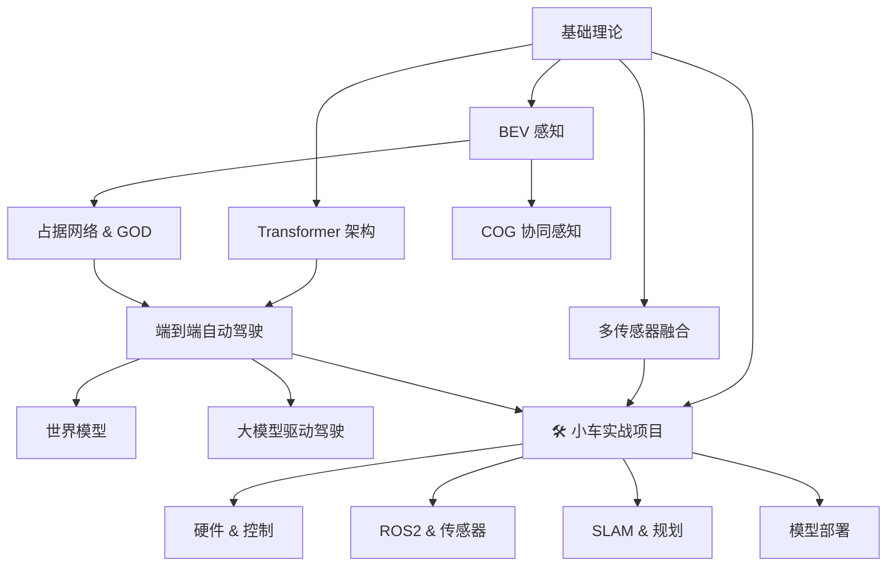

# 🗺️ 智驾模型知识库地图

> 这张地图帮助你快速定位到想学习的内容。从中心向外扩展，逐步深入。

---

## 📍 学习路径

---

## 📂 知识库结构

### 📝 00-方法论

| 笔记 | 内容 | 状态 |
|------|------|:--:|
| [[笔记写作规范]] | 🔥 教学版写作宪法：结构、原则、语法、Git 流程 | ✅ |
| [[后续扩展大纲]] | 🔥 待扩充笔记的章节级大纲，按图施工 | ✅ |
| [[前沿追踪与面试准备]] | 🔥 前沿方向路线图 + 月度更新机制 + 面经/面试题计划 | ✅ |

### 🧠 01-基础理论

| 笔记 | 内容 | 状态 |
|------|------|:--:|
| [[计算机视觉基础]] | CNN, 目标检测, 语义分割, 实例分割 | 📝 |
| [[Transformer架构详解]] | Attention, ViT, DETR, 位置编码 | 📝 |
| [[Transformer进阶知识]] | FlashAttention, MoE, RoPE, Swin, GQA | 📝 |
| [[3D视觉与投影几何]] | 相机模型, 点云, 体素, 投影变换 | 📝 |
| [[多传感器融合基础]] | LiDAR+Camera+Radar 融合策略 | 📝 |
| [[模型基础知识补充]] | 🔥 损失函数, 超参数, 数据增强, 训练技巧 | 📝 |

### 🏗️ 02-感知模型

| 笔记 | 内容 | 状态 |
|------|------|:--:|
| [[BEV感知全景]] | BEV 核心思想、方法分类、模型速览 | ✅ |
| [[BEVFormer详解]] | 时空 Transformer BEV 特征变换 (公式+代码+追问) | ✅ |
| [[BEVDet与BEVDepth]] | LSS 方式、深度监督、BEVPoolv2 | ✅ |
| [[PETR系列]] | 3D 位置编码隐式视角变换 (v1→v2→StreamPETR) | ✅ |
| [[占据网络与GOD]] | OCC、通用目标检测、占据栅格 (TPV+FlashOcc) | ✅ |
| [[COG协同占据栅格]] | 协同感知、动态占据栅格 | 📝 |
| **[[多传感器融合与故障降级]]** | 🔥 时间同步、外参标定、LiDAR/Camera故障降级策略 | 📝 |
| **[[华为ADS技术方案]]** | 🔥 ADS 1.0→3.0 三代演进、GOD架构、PDP细节 | ✅ |

### 🚗 03-端到端模型

| 笔记 | 内容 | 状态 |
|------|------|:--:|
| [[端到端自动驾驶概览]] | E2E 范式、核心模型、关键挑战 | ✅ |
| [[UniAD详解]] | 统一多任务端到端框架 | ✅ |
| [[VAD详解]] | 矢量化场景表征的端到端 | ✅ |
| **[[华为ADS端到端架构]]** | 🔥 GOD+PDP 分体式端到端, CAS 3.0 | ✅ |
| [[大模型与自动驾驶]] | DriveVLM, DriveGPT, LLM/AD | ✅ |
| [[世界模型]] | GAIA-1, DriveDreamer, OccWorld | ✅ |

### 📄 04-论文阅读

论文笔记，按模型/方向整理 → [[论文索引]]

### 💻 05-代码实践

| 笔记 | 内容 | 状态 |
|------|------|:--:|
| **[[小车项目总览]]** | 🚗 自动驾驶小车从零构建，硬件→控制→感知→端到端 | ✅ |
| **[[本地训练方案]]** | 🧪 本地 CPU + DirectML GPU 训练环境搭建 & 5 个实验设计 | ✅ |
| [[硬件选型指南]] | 底盘、主控、传感器、电源全套选型 | ✅ |
| [[底盘与电机控制]] | Arduino PWM、PID 调参、舵机控制、串口通信 | ✅ |
| [[传感器集成]] | 摄像头/超声波/IMU/编码器驱动与数据融合 | ✅ |
| [[ROS2入门]] | ROS2 核心概念与小车通信架构 | ✅ |
| [[SLAM与定位]] | Cartographer、ORB-SLAM、里程计、EKF 融合 | ✅ |
| [[路径规划与控制]] | A*、RRT、Pure Pursuit、Stanley、MPC | ✅ |
| [[模型部署]] | TensorRT、ONNX、Jetson 推理优化 | ✅ |
| [[端到端小车实战]] | 🔥 行为克隆完整流水线：数据采集→训练→闭环测试 | ✅ |

### 📅 06-每日记录

每日学习日记 → [[2026-07-21]]

### 🔗 07-资源索引

| 笔记 | 内容 |
|------|------|
| [[数据集索引]] | nuScenes, Waymo, KITTI, Occ3D 等 |
| [[开源项目索引]] | mmdet3d, OpenPCDet, UniAD 等 |
| [[学习资源]] | 课程、博客、视频、综述 |

### ⚙️ 08-训练与工程

| 笔记 | 内容 | 状态 |
|------|------|:--:|
| **[[数据闭环总览]]** | 🔥 数据飞轮、五步闭环、影子模式、业界方案 | ✅ |
| **[[领域迁移与数据闭环]]** | 🔥 Domain Gap 诊断、数据策略、闭环迭代、影子模式 | 📝 |
| **[[三阶段训练范式]]** | 🔥 Pretrain→SFT→RLHF/DPO/GRPO 完整流程 | ✅ |
| **[[模型训练与微调]]** | 预训练、微调(LoRA)、持续学习、联合训练 | 📝 |
| **[[AI-Infra详解]]** | 🔥 分布式训练(DDP/FSDP/ZeRO)、混合精度、Profiling | ✅ |
| **[[模型部署与延迟优化]]** | 🔥 延迟预算、TensorRT深度优化、INT8逐层分析 | ✅ |
| **[[训练排错实战手册]]** | 🔥 Loss NaN/震荡/不收敛/过拟合 系统排查 | 📝 |
| **[[评测消融与GT构造]]** | 🔥 评测回归体系、消融实验设计、GT构造、模态统一 | 📝 |
| **[[数据挖掘与自动标注]]** | 主动学习、corner case 挖掘、自动标注 | 📝 |
| **[[OTA更新与持续部署]]** | 灰度发布、Canary、回滚、车端优化 | 📝 |

### 🎯 09-面试准备

| 笔记 | 内容 | 状态 |
|------|------|:--:|
| **[[常见面试题-感知算法]]** | 🔥 40 道高频题 (BEV/3D检测/Train/部署/Coding) | ✅ |
| **[[面试准备策略]]** | 🔥 目标公司、简历、复习路线、面经、薪资 | ✅ |
| **[[智驾算法面试题库]]** | ✅ 面试题总纲：VLA 新题 10 道 + 面经索引 + 月度补充 | ✅ |

### 🌐 10-前沿追踪（月度更新）

| 笔记 | 内容 | 状态 |
|------|------|:--:|
| **[[VLA入门与智驾应用]]** | ✅ VLA 架构、智驾应用、面试追问 | ✅ |
| **[[具身智能热点追踪]]** | ✅ 人形机器人 vs 智驾、XR-1/π0、迁移叙事 | ✅ |
| **[[端到端前沿2025+]]** | ✅ VLA 化、世界模型增强、生成式规划、PnC 融合 | ✅ |
| **[[华为智驾动态追踪]]** | ✅ 乾崑/ADS 4.0、盘古、具身布局（季度更新） | ✅ |
| **[[AI-Infra前沿]]** | 📌 计划：超节点、推理优化 | 📌 |
| **[[感知算法前沿]]** | 📌 计划：稀疏感知、开放词汇 | 📌 |
| **[[大模型训练技巧进阶]]** | ✅ GRPO 深入、DPO 变体、蒸馏/合成数据 | ✅ |

---

## 🎯 推荐学习顺序

### 新手路径（0→1）

1. [[计算机视觉基础]] → 了解 CNN、目标检测、语义分割
2. [[Transformer架构详解]] → 理解 Attention 机制
3. [[3D视觉与投影几何]] → 相机模型、投影变换
4. [[BEV感知全景]] → BEV 的整体认识
5. [[BEVDet与BEVDepth]] → LSS 方式入门
6. [[BEVFormer详解]] → Transformer 方式入门
7. [[占据网络与GOD]] → 3D 占据感知
8. [[端到端自动驾驶概览]] → 端到端范式入门
9. [[UniAD详解]] → 端到端实战

### 进阶路径（1→10）

1. [[PETR系列]] → 不同 BEV 视角变换方案对比
2. [[多传感器融合基础]] → 融合策略深入
3. [[COG协同占据栅格]] → 多车协同感知
4. [[VAD详解]] → 矢量化端到端
5. [[大模型与自动驾驶]] → 前沿方向
6. [[世界模型]] → 未来趋势

### 🛠 实践路径（造一辆自动驾驶小车）

1. [[小车项目总览]] → 项目全貌、L0→L4 分级路线
2. [[硬件选型指南]] → 买什么、多少钱、怎么接
3. [[底盘与电机控制]] → 让轮子转起来、PID 调参
4. [[传感器集成]] → 摄像头/超声波/IMU 驱动
5. [[ROS2入门]] → 多传感器通信架构
6. [[SLAM与定位]] → 知道小车在哪
7. [[路径规划与控制]] → 怎么走到目标
8. [[模型部署]] → 把 AI 模型装进小车
9. [[端到端小车实战]] → 🔥 数据采集→训练→闭环跑起来

---

## 🔗 关键概念连接

- **BEV 感知**：[[BEV感知全景]] → [[BEVFormer详解]] → [[PETR系列]] → [[BEVDet与BEVDepth]]
- **3D 占据**：[[占据网络与GOD]] → [[COG协同占据栅格]] → [[华为ADS技术方案]]
- **端到端**：[[端到端自动驾驶概览]] → [[UniAD详解]] → [[VAD详解]] → [[华为ADS端到端架构]] → [[大模型与自动驾驶]]
- **融合**：[[多传感器融合基础]] → [[BEV感知全景]] → [[华为ADS技术方案]]
- **工程**：[[数据闭环总览]] → [[数据挖掘与自动标注]] → [[模型训练与微调]] → [[AI-Infra详解]] → [[OTA更新与持续部署]]
- **小车实践**：[[小车项目总览]] → [[硬件选型指南]] → [[底盘与电机控制]] → [[传感器集成]] → [[ROS2入门]] → [[SLAM与定位]] → [[路径规划与控制]] → [[模型部署]] → [[端到端小车实战]]
- **模型训练**：[[本地训练方案]] → YOLOv8 → 车道线分割 → 深度估计 → 端到端

---

> 💡 每个笔记底部都有 **"相关笔记"** 小节，点击即可跳转到关联内容。
>
> 📚 **2026-08 知识库升级**：核心笔记已升级为"教学版"结构——
> - 开头 **🧭 本篇导读**：这篇学什么 / 需要的前置知识 / 学完你能做什么 / 预计时间
> - 正文：大白话讲解 + 比喻 + 逐步推导 + 常见误区速查
> - 结尾 **✅ 检验自己**（自测题 + 可折叠参考答案）、**🛠 动手练习**（纸笔/代码/进阶）、**➡️ 下一步学什么**
>
> 已升级笔记：[[计算机视觉基础]]、[[Transformer架构详解]]、[[3D视觉与投影几何]]、[[多传感器融合基础]]、[[模型基础知识补充]]、[[BEV感知全景]]、[[BEVDet与BEVDepth]]、[[BEVFormer详解]]、[[PETR系列]]、[[占据网络与GOD]]、[[端到端自动驾驶概览]]、[[UniAD详解]]、[[VAD详解]]、[[华为ADS技术方案]]、[[大模型与自动驾驶]]、[[世界模型]]、[[华为ADS端到端架构]]、[[数据闭环总览]]、[[三阶段训练范式]]、[[AI-Infra详解]]、[[模型部署与延迟优化]]、[[小车项目总览]]、[[端到端小车实战]]、[[本地训练方案]]
>
> 🗺️ 后续要扩充的笔记大纲见 **[[后续扩展大纲]]**（PETR、VAD、华为 ADS、数据闭环等 30+ 篇，均已写好章节骨架）
>
> 🎯 不知道从哪开始？→ [[学习计划]] 含 7 个 Phase、可勾选清单 + 动态进度条。
