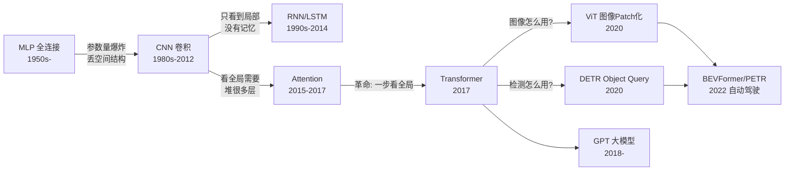
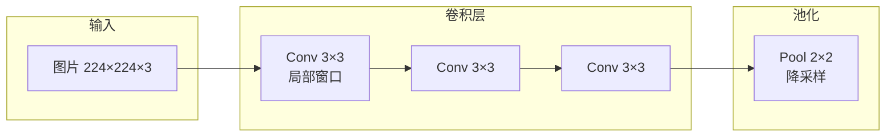
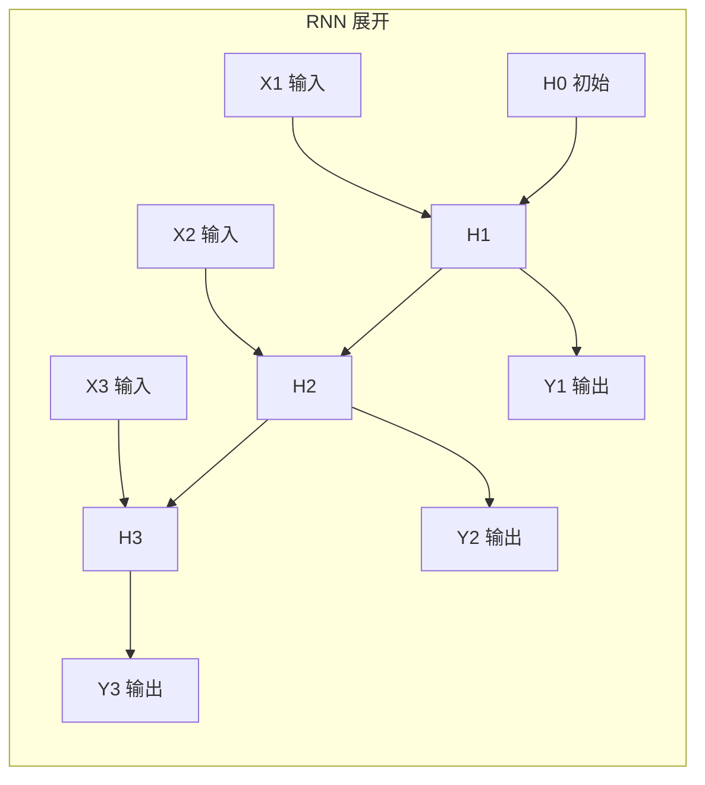
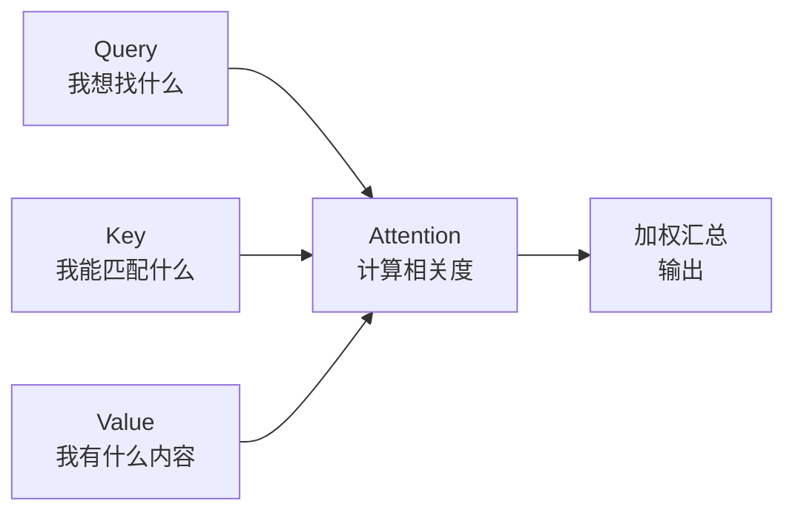
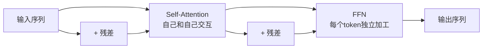
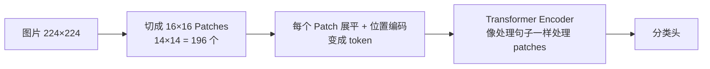
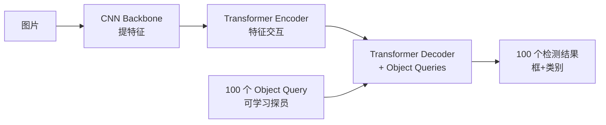
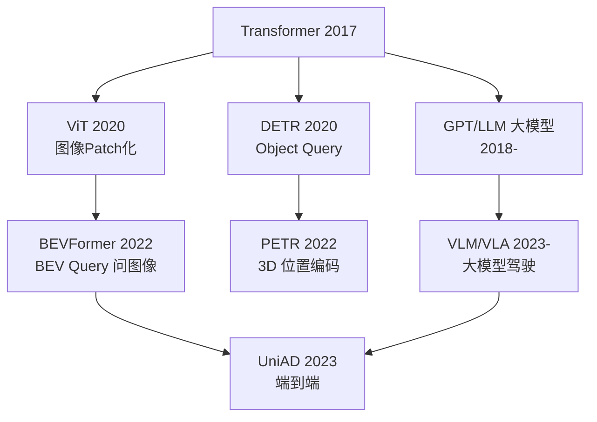

# 模型架构演进（MLP → CNN → Transformer）

> 一句话导读：你已经有 MLP、CNN、卷积的基础——这篇把"从 MLP 到 Transformer 再到 ViT/DETR"的**演进路线图**用图画清楚，让你看懂"为什么每个新架构出现"以及"新架构解决了什么"——**看完这篇，再读 [[Transformer架构详解]] 和 BEV 感知就没有障碍了**。

---

## 🧭 本篇导读

| 项目 | 内容 |
|------|------|
| **这篇学什么** | 模型架构演进史：MLP → CNN → RNN → Attention/Transformer → ViT → DETR，每个架构"解决什么问题、图怎么画、和上一个的关系" |
| **需要的前置知识** | MLP（全连接）、CNN、卷积的基础（你已有）|
| **学完之后你能** | ① 画出架构演进路线图；② 看懂任何模型的结构图（Transformer/ViT/DETR）；③ 理解"为什么 BEV 感知全是 Transformer" |
| **预计阅读时间** | 60-90 分钟 |

> [!tip] 怎么读这篇
> **这是"承上启下"的关键笔记**：承上（你的 MLP/CNN 基础）→ 启下（Transformer/BEV/端到端）。**每节都配图，先看图再读字**——图比字快 10 倍。读完这篇，[[Transformer架构详解]] 就是"复习 + 深入"。

---

## 〇、架构演进路线图（先看这张总图！）



> [!note] 读这张图的三个要点
> ① **每次演进都是"解决上一个的痛点"**：MLP 参数爆炸→CNN 共享权重；CNN 视野局限→Attention 看全局；② **Attention → Transformer 是分水岭**（2017 后一切皆 Transformer）；③ **ViT（图像）/DETR（检测）是 Transformer 进入视觉的两个入口**，最后汇合到自动驾驶（BEV 感知）。

---

## 一、从 MLP 到 CNN（你已有的基础，快速回顾）

### MLP（全连接）的问题

```
MLP: 输入图片展平成向量 → 每个神经元和所有像素相连
问题: ① 参数量爆炸（224×224×3 = 15 万像素全连接）
     ② 丢空间结构（相邻像素的关系没了）
```

### CNN 怎么解决



**CNN 的两个核心思想（你已会，确认一下）**：
- **局部性**：卷积核只看小窗口（3×3），不关心远处。
- **平移不变性**：权重共享（同一个核扫全图）。

> [!note] CNN 的"天花板"（为什么需要下一步演进）
> **CNN 的视野是"堆出来"的**：一层只看 3×3，要看全局得堆很多层（感受野逐层扩大）。**"看得远要堆层"= 慢 + 难训练**。同时 **CNN 没有"记忆"**（每帧独立处理，时序信息用不了）——这两个痛点引出 Attention 和 RNN。

---

## 二、RNN / LSTM（"记忆"从哪来）

### 解决什么问题

```
CNN: 每帧独立 → 视频里"上一帧的物体"下一帧忘了
RNN: 把上一时刻的"隐藏状态"传给下一时刻 → 有记忆
```



> [!note] 直觉
> RNN = "**带着上一个时刻的记忆处理当前时刻**"（隐藏状态 H 像"工作记忆"）。LSTM 是改进版（加"门控"：该记的记、该忘的忘）。**问题**：记忆是"串行的"（必须一步步传）→ 慢 + 长序列会"忘"（梯度消失）——**"串行传递记忆"是 RNN 的天花板**。

---

## 三、Attention → Transformer（2017 革命）

### Attention 解决什么问题（关键！）

```
RNN 的痛点: 记忆必须"串行传递"（一步步传，远的信息会丢）
Attention 的答案: 一步直接看所有位置（不需要传递，直接"问"）
```



> [!note] 直觉（查词典）
> **Query = 你要查的词，Key = 所有词条词头，Value = 词条内容**——拿 Q 和所有 K 算相关度，按相关度加权汇总 V。**"一步看全局 + 自动决定重点"**——这就是 Attention 的革命性：**不需要串行传递，直接全局交互**（[[Transformer架构详解]] 有完整推导）。

### Transformer = Attention 的"封装"



> [!note] Transformer 块 = "交流（Attention）+ 思考（FFN）"交替
> **Attention 管"token 之间交换信息"（横向），FFN 管"每个 token 自己加工"（纵向）**——"先交流、再思考、再交流、再思考"堆叠多层。**2017 年后，NLP 全换 Transformer（GPT 就是它）**——下一站：视觉怎么用？

---

## 四、ViT：图片怎么变成 token（2020）

### 关键思想："把图片当句子读"



> [!note] 直觉
> **图片 = 一串"像素块单词"**——切成 196 个 patch，每个 patch 当"一个词"处理，位置编码告诉 Transformer"这个词在图片哪里"，然后**和 NLP 完全一样的 Transformer 处理**。**"图像和文本用同一个架构"是 ViT 的意义**（多模态统一的第一步）。

---

## 五、DETR：检测的范式革命（2020）

### 关键思想："检测 = 查字典"



> [!note] 直觉
> **100 个"探员"（Object Query），每个负责盯一类目标，反复"问"图片特征后汇报**（"我盯到一辆车"）。**革命性**：① 不需要锚框（不用设计几十种框）；② 不需要 NMS（探员互相商量好，一个目标一个探员认领）；③ **端到端训练**（[[计算机视觉基础]] 提过 DETR）。**自动驾驶的意义**：DETR3D/BEVFormer/PETR 全是从它来的。

---

## 六、现代架构全家福（看完这张图，后面全通）



> [!note] 记住这张图，你就能"归类"任何模型
> **看到一个模型，先问"它从哪来的"**：BEVFormer 是 ViT+DETR 的结合（BEV Query 像 Object Query，采样像 ViT 的 patch 交互）；UniAD 是 BEVFormer 的端到端版；VLA 是 GPT+VLM 的驾驶版。**"架构谱系"是理解新模型的捷径**——所有模型都是这张图上的一个节点。

---

## 七、常见误区速查

> [!warning] 新手最常踩的坑
> 1. **以为 Transformer 是"NLP 专用"**——2017 是 NLP，2020 起 ViT/DETR 进入视觉，2022 起 BEV 感知全用它——**现在它是"通用架构"**。
> 2. **以为 Attention 是"新概念"**——2015 年就有了（机器翻译），Transformer 是"把 Attention 用到极致"。
> 3. **混淆 Self-Attention 和 Cross-Attention**——同源（自己和自己聊 vs 两个序列聊），[[Transformer架构详解]] 会细讲。
> 4. **以为 ViT 是"新 CNN"**——ViT 没有卷积！它把图片当 token 序列（和 NLP 完全同构）。
> 5. **跳过这篇直接读 BEV 笔记**——BEV 感知（[[BEV感知全景]]）默认你懂 Transformer/ViT/DETR——**这篇是"前置补课"**。

---

## ✅ 检验自己（自测题）

> [!question] Q1：画出架构演进路线图，并说每个演进"解决了上一个的什么痛点"。
> 提示：参数/视野/记忆/全局。

> [!success]- 参考答案
> MLP（参数爆炸、丢结构）→ CNN（共享权重、局部+平移不变，但视野靠堆层）→ RNN（有记忆，但串行传递会丢远信息）→ Attention/Transformer（一步看全局、自动决定重点）→ ViT（图片 patch 化，图像用上 Transformer）→ DETR（Object Query 端到端检测）→ BEV 感知（自动驾驶用上全套）。"每次演进 = 补上一个的短板"。

> [!question] Q2：Attention 的 Q/K/V 是什么？用查词典比喻。
> 提示：问/配/答。

> [!success]- 参考答案
> Q（Query）= 你要查的词（"我想找什么"）；K（Key）= 所有词条词头（"我能匹配什么"）；V（Value）= 词条内容（"我有什么"）。流程：Q 和所有 K 算相关度 → 归一化成权重 → 按权重加权汇总 V。直觉："一步看全局 + 自动决定重点"——不需要像 RNN 那样串行传递。

> [!question] Q3：ViT 怎么把图片变成 token？和 NLP 有什么共通？
> 提示：patch。

> [!success]- 参考答案
> 图片切成 16×16 patches（224×224 → 14×14=196 个）→ 每个 patch 展平 + 位置编码变成 token → 和 NLP 完全一样的 Transformer Encoder 处理。共通：**"图像和文本用同一个架构"**——位置编码解决"patch 在哪"，Transformer 解决"patch 怎么交互"——多模态统一的第一步。

> [!question] Q4：DETR 的 Object Query 是什么？为什么不需要 NMS？
> 提示：探员。

> [!success]- 参考答案
> Object Query = 100 个可学习向量（"探员"），每个通过 Cross-Attention 反复"问"图片特征，最终"长成"一个检测结果。不需要 NMS：探员之间通过注意力互相"商量"（一个目标一个探员认领，互不重复）。也不需要锚框（不用手工设计框）。端到端训练（匈牙利匹配分配真值）——DETR3D/BEVFormer/PETR 都从它来。

> [!question] Q5：看到一个新模型（如 UniAD），怎么快速"归类"？
> 提示：架构谱系。

> [!success]- 参考答案
> 先问"它从哪来的"：UniAD = BEVFormer（BEV Query）的端到端版；BEVFormer = ViT（patch 交互）+ DETR（Query）的结合；VLA = GPT（LLM）+ VLM（视觉语言）的驾驶版。**"架构谱系"是理解新模型的捷径**——所有模型都是"演进路线图"上的一个节点，先归位再细读。

---

## 🛠 动手练习

### 练习 1：画"架构演进时间线"（20 分钟）

用 Excalidraw 画一条时间线（1950s → 2024），标注：
1. 每个架构的出现年份和代表工作。
2. 每个架构的"一句话痛点"（它解决了什么）。
3. 用箭头标出"谁启发了谁"。

> [!tip] 这是"架构谱系"的建立
> 能画出时间线 = 你有了"归类新模型"的地图。以后读论文先问"它是时间线上的哪个节点"。

### 练习 2：把"输入-处理-输出"画出来（60 分钟）

选 3 个架构（CNN / Transformer / DETR），各画一张"输入 → 中间 → 输出"数据流图：
1. CNN：图片 → 卷积+池化 → 特征图 → 分类头。
2. Transformer：序列 → Attention+FFN → 序列。
3. DETR：图片 → CNN → Encoder → Decoder+Query → 检测结果。

> [!tip] 这是"看懂论文结构图"的训练
> 论文的 Figure 1 都是这种"方块+箭头"图——**你先自己画一遍，再看论文就不懵了**。画完对照 [[Transformer架构详解]] 的架构图检查。

### 练习 3：用 torch 搭最小 Transformer 块（可选，60 分钟）

```python
import torch
import torch.nn as nn

class TransformerBlock(nn.Module):
    """最小 Transformer 块：Attention + FFN + 残差"""
    def __init__(self, d_model=64, nhead=4):
        super().__init__()
        self.attn = nn.MultiheadAttention(d_model, nhead)
        self.ffn = nn.Sequential(
            nn.Linear(d_model, d_model*2), nn.GELU(),
            nn.Linear(d_model*2, d_model))
        self.norm1 = nn.LayerNorm(d_model)
        self.norm2 = nn.LayerNorm(d_model)

    def forward(self, x):
        # x: [seq_len, batch, d_model]
        x = x + self.attn(x, x, x)[0]      # Self-Attention + 残差
        x = self.norm1(x)
        x = x + self.ffn(x)                 # FFN + 残差
        return self.norm2(x)

# 跑一下：10 个 token，每个 64 维
x = torch.randn(10, 2, 64)   # [seq, batch, d]
out = TransformerBlock()(x)
print("输入:", x.shape, "→ 输出:", out.shape)  # 形状不变
```

> [!tip] 做完后自问
> ① 去掉残差（`x +`）会怎样？② 把 `nn.MultiheadAttention` 换成"自己写 QKV 点积"（[[Transformer架构详解]] 练习 2）——两篇联动的完整练习。

---

## ➡️ 下一步学什么

按知识库学习路径（已重新排序），读完本篇你应该接着：

1. **[[Transformer架构详解]]** —— Attention 的完整推导（本篇是"地图"，那篇是"细节"）。
2. **[[计算机视觉基础]]** —— CNN/检测/分割复习（如果有需要）。
3. **[[3D视觉与投影几何]]** —— 3D 几何基础（BEV 的数学）。
4. **[[BEV感知全景]]** —— 到这里，你已经有全部前置知识，开始 BEV 主线。

> 💡 恭喜！你已经从"MLP/CNN 基础"升级到"能看懂 Transformer/ViT/DETR 架构"——**知识库所有模型笔记的门槛都过了**。接下来按调整后的学习路径走，每一篇都会"读得懂、跟得上"。

---

## 相关笔记

- [[Transformer架构详解]] — Attention 完整推导（下一篇）
- [[计算机视觉基础]] — CNN/检测/分割（基础回顾）
- [[BEV感知全景]] — BEV 主线起点
- [[3D视觉与投影几何]] — 3D 几何基础
- [[多传感器融合基础]] — 建议 BEV 之后读（顺序已调整）
