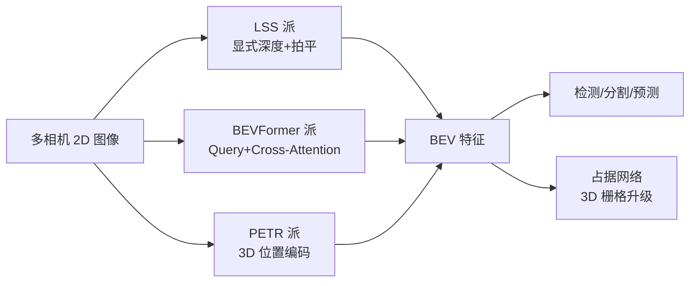

# BEV 感知全景

> 一句话导读：BEV（Bird's Eye View，鸟瞰图）感知是当前自动驾驶感知的核心范式——**把多视角相机的 2D 图像，统一"翻译"成一张车顶俯瞰的鸟瞰图特征**，再在这张图上做检测、分割、预测。本篇先建立 BEV 的整体认知：为什么需要它、有哪几条技术路线、各路线代表模型是什么。

---

## 🧭 本篇导读

| 项目 | 内容 |
|------|------|
| **这篇学什么** | BEV 的四大动机、四条主流技术路线（LSS 派 / BEVFormer 派 / PETR 派 / 占据网络）、代表模型与对比 |
| **需要的前置知识** | [[计算机视觉基础]]（检测/分割）、[[Transformer架构详解]]（注意力）、[[3D视觉与投影几何]]（投影数学） |
| **学完之后你能** | ① 说出 BEV 的四大优势并解释每条；② 画出四条技术路线的分类图；③ 面对一个新 BEV 论文能判断它属于哪条路线；④ 决定接下来精读哪一篇 |
| **预计阅读时间** | 45-60 分钟 |

> [!tip] 本篇是"地图"，不是"终点"
> 这篇讲"BEV 有什么、分几派"，具体机制在 [[BEVDet与BEVDepth]]、[[BEVFormer详解]]、[[PETR系列]] 里展开。**先有全景，再钻细节**——带着"它属于哪一派"的问题去读细节，效率最高。

---

## 一、为什么需要 BEV——先看"不用 BEV"的痛点

想象一辆车装了 6 个相机（前、前侧、后侧……），每个相机拍到自己视角的一张图。**如果直接用这些 2D 图做感知，会遇到四个问题：**

### 痛点 1：多相机融合没有"公共坐标系"

6 张图各说各话：前相机说"前方 30° 有车"，左前相机也说"左前 30° 有车"——**它们说的是同一个物体还是两个物体？** 没有统一坐标系，就无法判断。而且不同相机的视野还有重叠区（拼接处），重叠区里的目标容易被重复检测或漏检。

**BEV 的解法**：把 6 张图的特征全部投影到**同一个地面坐标系**（车顶俯瞰的网格）——6 张图变成 1 张"地图"，重叠区自动融合，同一辆车只有一个位置。

### 痛点 2：透视图像里，距离和位置被"压扁"

普通相机图像是透视投影：近大远小，且**物体的 3D 位置被压进 2D 平面**。规划模块需要的是"车在我的前方 20 米、偏左 1 米"这种**物理坐标**，而透视图像里"前方 20 米"对应哪个像素，取决于相机内参、畸变、物体高度——**几何关系一团乱**。

**BEV 的解法**：BEV 空间本身就是物理坐标系（每个格子 = 地面上的 x 米 × y 米）。**感知结果天然就是规划需要的坐标**，不用再做 2D→3D 的几何换算。

### 痛点 3：透视畸变让"同一辆车"在不同位置长得不一样

同一辆车，在图像中央是正的、在图像边缘是斜的、被前车挡住一部分……**同一个目标在不同位置、不同时刻的表观完全不同**，检测器很难统一处理。

**BEV 的解法**：鸟瞰图里，**目标的形态不随位置变化**（车在哪儿都俯视看到车顶），且不同时刻同一目标在 BEV 上的位置连续变化——**表观一致性 + 时序一致性**都变好了。

### 痛点 4：时序信息难以利用

自动驾驶必须理解运动（前车在减速吗？行人要过马路吗？）。单帧图像做不了，需要跨帧关联——但透视图像里，**车一运动，整幅画面都变**（视差效应），跨帧对齐非常麻烦。

**BEV 的解法**：车动了，但**世界没动**——BEV 特征固定在世界坐标系里（用 ego-motion 对齐），上一帧的 BEV 特征直接"搬"到这一帧就能用。**时序融合在 BEV 空间里天然简单**（BEVFormer 的 Temporal Self-Attention 就是这么干的）。

### 小结：BEV 的四大优势

> [!success] 一句话总结 BEV 的价值
> **统一坐标系（多相机融合）+ 物理坐标天然可用（对接规划）+ 表观/时序一致（感知更稳）+ 时序融合简单（理解运动）。** 这四点让 BEV 成为感知和规划之间的"标准语言"。

---

## 二、主流方法分类——四条技术路线

BEV 感知的进化史，核心就是回答一个问题：**"怎么把 2D 图像特征搬到 BEV 空间？"** 目前有四条路线（[[3D视觉与投影几何]] 里的"显式 vs 隐式"是理解它们的关键）：

### 路线 1：基于深度估计（Lift-Splat-Shoot / LSS 派）——"先量距离，再搬特征"

```
2D 图像特征 + 深度分布预测 → 3D 视锥 (Frustum) → 拍平 (Splat) → BEV 特征
```

**代表模型**：**BEVDet** / **BEVDepth**

**核心思想**：显式预测每个像素的深度分布，把 2D 特征"抬升"到 3D 空间，再按 BEV 网格拍平求和。
**优点**：显式可解释，实现简单，工程成熟。
**缺点**：深度估计不准 → 整个 BEV 都歪（级联误差）。

> 详见 [[BEVDet与BEVDepth]]（新手路径第 2 站）

### 路线 2：基于 Transformer（BEVFormer 派）——"直接问图像要答案"

```
BEV Queries（可学习网格向量）→ 空间/时序 Cross-Attention → 更新后的 BEV 特征
```

**代表模型**：**BEVFormer**

**核心思想**：BEV 网格上每个格子是一个可学习 query，通过注意力机制**直接从多相机图像特征里"提取"**它需要的信息（参考点投影 + Deformable Attention），并融合历史帧的 BEV 特征（时序）。
**优点**：不需要显式深度估计，避免级联误差；时序融合自然。
**缺点**：注意力计算量大（推理慢），实现复杂。

> 详见 [[BEVFormer详解]]（新手路径第 3 站）

### 路线 3：基于位置编码（PETR 派）——"给每个像素贴上 3D 地址"

```
图像特征 + 3D 位置编码 (3D PE) → 直接当 query 用 → 隐式完成视角变换
```

**代表模型**：**PETR** / **PETRv2** / **StreamPETR**

**核心思想**：把 3D 坐标编码进图像特征（3D PE），**省掉显式投影和 query 投影**——网络自己学会"图像特征在 3D 空间的哪里"。
**优点**：结构简洁，天然适合时序（StreamPETR）。
**缺点**：位置编码的设计空间大，效果依赖编码方式。

> 详见 [[PETR系列]]（进阶路径）

### 路线 4：占据网络——"从 2D 地图升级到 3D 空间"

```
BEV/多视角特征 → 3D 占据栅格（每个格子的占用概率 + 语义）→ 完整 3D 场景理解
```

**代表模型**：**Occ3D** / **SurroundOcc** / **TPVFormer**

**核心思想**：BEV 是"地面地图"，占据网络是"**3D 空间地图**"——把车身周围空间切成 3D 格子，预测每个格子有没有东西、是什么。能处理 BEV 搞不定的**不规则障碍物、悬空物体、立交桥分层**。
**优点**：更完整的 3D 理解，泛化到任意形状障碍物。
**缺点**：3D 表示显存/算力大。

> 详见 [[占据网络与GOD]]（新手路径第 4 站）

### 四条路线的关系图



---

## 三、关键模型速览——记住"谁是谁"

| 模型 | 年份 | 路线 | 核心方法 | 一句话记忆 |
|------|------|------|----------|-----------|
| BEVDet | 2022 | LSS | Lift-Splat-Shoot | LSS 派代表作，显式深度 |
| BEVDepth | 2022 | LSS | 深度真值监督 | 用 LiDAR 教相机看距离 |
| BEVFormer | 2022 | Transformer | 时空 Deformable Attention | Query 问图像要答案 |
| BEVFormer v2 | 2023 | Transformer | 透视监督 | 用 2D 检测辅助 3D |
| PETR | 2022 | 位置编码 | 3D PE + DETR | 像素贴 3D 地址 |
| PETRv2 | 2023 | 位置编码 | 时序 PETR | PETR + 历史帧 |
| StreamPETR | 2023 | 位置编码 | 流式时序 | 不再缓存 BEV，直接流式传播 |
| FB-BEV | 2024 | 混合 | 前向-后向 BEV | 两方向投影结合 |

> [!note] 看模型的正确姿势：年份 × 路线 × 创新点
> - 2022 年是 BEV 爆发年（BEVDet/BEVFormer/PETR 同年出现），此后都在**卷"怎么把时序用起来"**（BEVDet4D → PETRv2 → StreamPETR）。
> - 路线之间的差异集中在"视图变换"这一步（怎么搬特征），**检测头、后处理反而是共通的**——所以看懂一条路线，其他路线就懂了一大半。

---

## 四、BEV 评测指标速览

BEV 感知模型用 nuScenes 等数据集评测，核心指标（[[模型基础知识补充]] 有详细数值表）：

| 指标 | 衡量什么 | 直觉 |
|------|----------|------|
| **mAP** | 检测精度（找没找到） | 漏检 + 误检的平衡 |
| **NDS** | 综合检测质量 | mAP + 位置/朝向/尺寸/速度精度 |
| **mIoU** | BEV 分割精度 | 车道线/可行驶区域分割质量 |
| **FPS** | 推理速度 | 能不能实时（量产 ≥10FPS） |

> [!warning] 精度和速度必须一起看
> BEVFormer 精度高但只有 2.5 FPS，BEVDet 精度稍低但 15 FPS——**论文刷榜看精度，量产看 FPS**。读论文时养成习惯：先看 FPS 再看 mAP。

---

## 五、常见误区速查

> [!warning] 新手最常踩的坑
> 1. **以为 BEV 是"拍照"得到的**——不是！没有相机真的从天上拍。BEV 是**网络从 2D 特征"重建"出来的隐式表示**，靠的是视图变换模块。
> 2. **以为 BEV 图 = 高精地图**——BEV 特征图是"模型学出来的稠密特征"，高精地图是"人工标注的矢量地图"，两回事（[[多传感器融合基础]] 里有区分）。
> 3. **混淆四条路线**——区分关键在"视图变换怎么做"：显式深度（LSS）/ query 注意力（BEVFormer）/ 位置编码（PETR）/ 3D 栅格（OCC）。
> 4. **以为 BEV 只有相机能用**——BEV 是"公共坐标系"，LiDAR 点云也能转成 BEV（BEVFusion 里 LiDAR BEV + Camera BEV 融合，见 [[多传感器融合基础]]）。
> 5. **忽略时序**——单帧 BEV 和带时序的 BEV（BEVFormer/BEVDet4D）精度差距明显，时序是 BEV 性能的关键放大器。

---

## ✅ 检验自己（自测题）

> [!question] Q1：说出 BEV 的四大优势，并各举一个"没有 BEV 会怎样"的反例。
> 提示：从多相机、规划、表观、时序四个角度。

> [!success]- 参考答案
> ① 统一坐标系：没有 BEV，6 个相机的检测结果无法判断是否同一个物体，重叠区重复检测；② 物理坐标天然可用：没有 BEV，图像坐标要经过几何换算才能给规划用，且透视投影下"前方 20 米"难以直接对应像素；③ 表观一致：没有 BEV，同一辆车在图像不同位置形态不同（透视畸变），检测不稳定；④ 时序融合简单：没有 BEV，车一动整幅透视画面都变，跨帧对齐困难；BEV 固定在世界坐标系，用 ego-motion 对齐后历史帧直接可用。

> [!question] Q2：四条技术路线的区分标准是什么？分别用一个词概括各自的核心机制。
> 提示：想想"视图变换"这一步怎么做。

> [!success]- 参考答案
> 区分标准是"2D 特征如何搬到 BEV 空间"：LSS 派 = 显式深度（先量距离再拍平）；BEVFormer 派 = Query 注意力（直接问图像要答案）；PETR 派 = 位置编码（给像素贴 3D 地址，隐式完成变换）；占据网络 = 3D 栅格（从 2D 地图升级到 3D 空间）。

> [!question] Q3：BEVFormer 为什么不需要显式深度估计？相比 LSS 派，它的代价是什么？
> 提示：从"级联误差"和"计算量"两个角度。

> [!success]- 参考答案
> BEVFormer 用 Cross-Attention 让 BEV query 直接从图像特征里"提取"信息，深度关系被注意力隐式学习，避免了 LSS 派"深度估计不准 → BEV 全歪"的级联误差。代价是注意力计算量大（标准 Attention O(N²)，BEVFormer 用 Deformable Attention 降到 O(N×K) 仍比 LSS 重），推理速度慢（2.5 FPS vs BEVDet 15 FPS）。

> [!question] Q4：PETR 和 BEVFormer 都算"隐式派"，它们的本质区别是什么？
> 提示：一个在"图像特征"上做文章，一个在"BEV query"上做文章。

> [!success]- 参考答案
> BEVFormer 把 3D 信息放在 **query 侧**（BEV query 投影到图像采样），图像特征本身是"纯 2D"的；PETR 把 3D 信息放在**特征侧**（给图像特征加上 3D 位置编码），特征本身就"知道自己在 3D 哪里"，之后直接用 DETR 式解码。一个靠"问"（query 去采），一个靠"标"（特征带地址）。

> [!question] Q5：为什么说占据网络是"BEV 的升级"？BEV 处理不了什么场景？
> 提示：想想高度信息和悬空物体。

> [!success]- 参考答案
> BEV 是沿 Z 方向压缩的 2D 地图，丢失高度信息，区分不了"立交桥上层/下层"、"悬空的树枝"、"横在路中间的不规则障碍物"这类场景。占据网络保留 3D 高度信息，预测每个 3D 格子的占用和语义，能处理任意形状、任意高度的障碍物——代价是 3D 表示的显存和算力大幅上升。

---

## 🛠 动手练习

### 练习 1：纸笔画出四条路线对比表（20 分钟）

画一张 4 行 × 6 列的表格：路线 / 代表模型 / 视图变换怎么做 / 深度是显式还是隐式 / 优缺点 / 适合场景。**不翻笔记**，凭记忆填，填完再对照本篇第三节检查。

> [!tip] 这个练习的目标不是"背表"
> 而是逼自己想清楚："如果我要把 2D 特征搬到 BEV，我会怎么做？"——想不出再翻笔记，印象会深得多。

### 练习 2：看图判断路线（15 分钟）

打开任意 3 篇 BEV 论文的框架图（arXiv 搜 BEVDet / BEVFormer / PETR，只看 Figure 1），快速判断：
1. 它的核心模块长什么样（有深度分支？有 query？有位置编码？有 3D 栅格？）
2. 属于哪条路线
3. 它的"视图变换"步骤标在哪

> [!tip] 判断技巧
> 看到"深度分支 + 视锥" → LSS 派；看到"BEV grid + 采样/注意力" → BEVFormer 派；看到"3D position embedding" → PETR 派；看到"3D voxel/occupancy 输出" → 占据网络。**10 秒就能归类。**

### 练习 3：读一篇 BEV 综述（进阶，可选，2-3 小时）

读 Vision-Centric BEV Perception Survey（视觉中心 BEV 感知综述），只读 Introduction 和 Method Taxonomy 两节，画出综述里对方法的分类树。**目标**：把你自己的四路线分类和综述的分类对照，找出差异——这能帮你建立超越"背笔记"的体系感。

---

## ➡️ 下一步学什么

按知识库学习路径，读完本篇你应该接着：

1. **[[BEVDet与BEVDepth]]** —— 路线 1（LSS 派）的完整机制，新手路径第 2 站。
2. **[[BEVFormer详解]]** —— 路线 2（Transformer 派）的完整机制，新手路径第 3 站。
3. **[[占据网络与GOD]]** —— 路线 4 的完整机制，新手路径第 4 站。
4. **[[PETR系列]]** —— 进阶再看路线 3。
5. **[[多传感器融合基础]]** —— BEV 作为多模态"公共语言"的融合视角。

> 💡 推荐对比学法：先读 [[BEVDet与BEVDepth]] 再读 [[BEVFormer详解]]，两篇对照——**同样的 BEV 目标，两条完全不同的技术路线**，对比着学能同时吃透两篇。

---

## 相关笔记

- [[BEVFormer详解]] — Transformer 方式 BEV 特征变换
- [[BEVDet与BEVDepth]] — LSS 方式视图变换
- [[PETR系列]] — 3D 位置编码隐式变换
- [[占据网络与GOD]] — BEV → 3D 占据的升级
- [[COG协同占据栅格]] — 多车协同占据感知
- [[华为ADS技术方案]] — 华为量产方案：从 BEV 到 GOD 的演进
- [[端到端自动驾驶概览]] — 感知之后的完整链路
