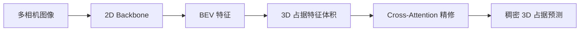

# 占据网络与 GOD (通用目标检测)

> 从「检测已知类别」到「感知所有占据空间」— 占据网络是 BEV 感知的 3D 升级，GOD (General Object Detection) 解决未知/长尾障碍物。

---

## 一、为什么需要占据网络

### BEV 检测的局限

| BEV 检测 | 占据网络 |
|----------|----------|
| 预测 3D Bounding Box | 预测每个体素的占据+语义 |
| 只能检测预定义类别 | 可以表示任意形状物体 |
| 矩形框无法描述不规则物体 | 体素级精细表示 |
| 遗漏未分类障碍物（如散落货物、异形路障）| 所有占据空间都被标注 |

### 核心问题

现实世界有无穷多种障碍物，纯检测范式不可能枚举所有。占据网络 = **无类别限制的空间感知**。

---

## 二、占据网络基础

### 定义

```
输入: 多相机图像 (可选 LiDAR)
输出: 3D 占据栅格 Occupancy Grid (X×Y×Z)
       每个体素: [占据概率, 语义类别(可选)]
```

### 占据表示的分类

| 方法 | 表示 | 代表 |
|------|------|------|
| **2D BEV 占据** | 只预测 BEV 平面的占据 | BEVDet 的 occupancy |
| **2.5D** | BEV + 离散高度 | HDMapNet |
| **3D 密集占据** | 完整 3D 体素栅格 | SurroundOcc, Occ3D |
| **TPV (三视角)** | 3 个正交平面编码 3D | TPVFormer |
| **隐式占据** | 神经网络隐式表示 | OccNet (Tesla) |

---

## 三、主流占据网络模型

### 1. Tesla Occupancy Network (AI Day 2022)

**核心方案**：
```
8 个相机视频 → Video Module (时空特征提取)
                ↓
         Occupancy Features (3D 体素空间)
                ↓
    Occupancy Head → 体素占据 + 语义 + 流速
                ↓
         无需 HD Map，直接在占据空间做规划
```

**关键特性**：
- 10ms 延迟端到端
- 预测占据 + 语义 + flow
- 用 Occupancy 替代传统检测来做规划

### 2. TPVFormer (CVPR 2023)

> **论文**: Tri-Perspective View for Vision-Based 3D Semantic Occupancy Prediction

**核心创新**：用三个正交平面表示 3D，而非密集体素：

```
3D 空间
  │
  ├── XY 平面 (BEV / Top-down)  "俯视"
  ├── XZ 平面 (Front view)      "前视"
  └── YZ 平面 (Side view)       "侧视"

每个体素 (x,y,z) 的特征 = XY[x,y] + XZ[x,z] + YZ[y,z]
```

**优势**：
- 大幅降低显存（O(XY+XZ+YZ) vs O(XYZ)）
- 保留精细的 3D 结构信息

### 3. SurroundOcc (ICCV 2023)

**核心方案**：


- **输入**：6 个环视相机
- **输出**：200×200×16 占据栅格，每个体素 17 类语义
- **训练数据**：用 LiDAR 点云生成稠密占据真值

### 4. FB-OCC / FlashOcc (2023-2024)

**趋势**：降低占据网络的计算量，实现实时运行

| 模型 | 创新 | 速度 |
|------|------|:--:|
| **FlashOcc** | 通道到高度变换 (Channel-to-Height) | 实时 ⚡ |
| **FB-OCC** | 前向-后向 BEV 投影 | 快速 |
| **FastOcc** | 轻量化设计 | 实时 ⚡ |
| **SparseOcc** | 稀疏体素表示 | 快 |

#### FlashOcc 核心技术: Channel-to-Height

```python
# 传统方法: BEV [C, 200, 200] → 3D Conv 上采样 → [C, 200, 200, 16]
# → 3D Conv 计算量大!

# FlashOcc: 将通道维度重新解释为高度维度 (无需 3D Conv!)
# BEV feature: [C, 200, 200]
# 其中 C = C' × H_z (如 256 = 16 × 16)
# 直接 reshape: [256, 200, 200] → [16, 16, 200, 200] → permute → [16, 200, 200, 16]
# → 零额外计算! 纯 reshape 操作!

class ChannelToHeight(nn.Module):
    def forward(self, bev_feat):
        # bev_feat: [B, 256, 200, 200]
        # H_z = 16 (height bins)
        b, c, h, w = bev_feat.shape
        return bev_feat.reshape(b, -1, 16, h, w).permute(0, 1, 3, 4, 2)
        # → [B, 16, 200, 200, 16] — occupany prediction per height level
```

**为什么有效?** BEV 特征已经编码了 3D 信息（因为它来自多视角图像投影），通道维度自然包含了高度信息。不需要 3D Conv 来重构——直接 reshape 即可。这是最近轻量化占据网络的核心 trick。

---

## 四、GOD — 通用目标检测

（保持原有内容）

---

## 五、面试官追问

### Q: TPVFormer 的 O(XY+XZ+YZ) 复杂度怎么算的？

传统 3D Occupancy: $O(X \cdot Y \cdot Z)$ 个体素 (如 200×200×16=640K)
TPV: 只需存 3 个平面: $O(XY + XZ + YZ) = 200×200 + 200×16 + 200×16 = 40K + 3.2K + 3.2K = 46.4K$

节省: 640K / 46.4K ≈ **14×** 显存减少！

但代价：任何体素的信息由 3 个平面特征求和得到（sum of 3 values）→ 精度略低于完整 3D voxel → 适合表示**大尺度结构**，精细结构可能丢失。

### Q: Occ3D 的 17 类语义是怎么标注的？

17 类 = nuScenes 的 10 个检测类别 + 7 个额外的静态类别：

| 类型 | 类别 |
|------|------|
| 动态 (10类) | car, truck, bus, trailer, construction, pedestrian, motorcycle, bicycle, traffic_cone, barrier |
| 静态 (7类) | driveable_surface, other_flat, sidewalk, terrain, manmade, vegetation, free (empty) |

标注方法：利用 nuScenes 的 3D box 标注 → box 内部的 voxel 赋动态语义 → LiDAR 点投影到 voxel 赋静态语义 → 无观测区域标记为 unknown。

**核心问题**: 标注的完整性有限 — 被遮挡区域是 unknown, 远处 LiDAR 稀疏 → 模型需要学习填补这些空缺。

### Q: 占据网络的损失函数怎么设计？

```python
# 多任务损失:
L_total = L_occ + λ1 * L_semantic + λ2 * L_flow

# 占用损失: BCE per voxel
L_occ = BCE(occ_pred, occ_gt)  # [B, 200, 200, 16]

# 语义损失: 对占据的 voxel 做 CE
L_semantic = CE(semantic_pred[occ_gt==1], semantic_gt[occ_gt==1])

# 类别不平衡处理: 对静态类别（路面、植被）降权
# 因为路面占了 >50% 的占据 voxel → 不加权会被路面主导
class_weights = {driveable: 0.5, vegetation: 0.5, car: 2.0, pedestrian: 3.0, ...}
```

### Q: 占据网络 vs 3D 检测 vs BEV 检测的发展趋势？

2024 年的共识路线：

```
第一阶段 (2021-2022): BEV 2D Detection (BEVDet, BEVFormer)
  → 2D BEV 平面上的 BBox 检测

第二阶段 (2023-2024): BEV + 3D Occupancy (BEVFormer v2, Occ3D)
  → BEV 检测 + 3D 占据双输出

第三阶段 (2024-): 3D Occupancy-First (Tesla ON, 华为 GOD)
  → 以 3D 占据为主要感知输出
  → 检测从占据中导出（DBSCAN 聚类）
  → 占据直接供规划消费（替代 HD Map）
```

**关键驱动力**: 占据比 BBox 更适合规划（稠密空间信息 vs 稀疏物体信息）→ 规划可以直接在占据空间中做碰撞检测和路径搜索。

---

> 📚 **相关**: [[BEVFormer详解]], [[BEV感知全景]], [[华为ADS技术方案]]
> 🎯 **面试**: [[常见面试题-感知算法]] Q7-9

---

## 四、GOD — 通用目标检测

### 什么是 GOD

**GOD (General Object Detection)** = 检测**所有占据空间的物体**，不限于预定义类别。

这与传统目标检测的关键区别：

| | 传统检测 | GOD / 占据感知 |
|------|----------|----------------|
| **类别** | 预定义 (car, pedestrian...) | 不限类别 |
| **输出** | 3D Bbox | 体素占据 + 可选语义 |
| **未知物体** | 无法检测 | ✅ 可检测 |
| **长尾障碍** | 遗漏 | ✅ 可处理 |

### GOD 的实现路径

#### 路径 1：占据网络（OccNet）

```
图像 → 占据预测 → 体素聚类 → 实例 → 未知物体检测
```

占据网络天然就是 GOD — 任何占据空间的物体都被标记。

#### 路径 2：开放词汇检测 (Open-Vocabulary Detection)

```
图像 → CLIP/VLM 特征增强 → 检测头
                               ↓
                    支持未见过的类别（通过文本描述）
```

#### 路径 3：OOD 检测增强

```
标准检测器 + 异常分数（occupancy score / uncertainty）
                              ↓
                  不依赖类别的 "物体性" (objectness)
```

如 UNCOVER (2024) — 用 Occupancy Score 替代 IoU Score 来检测未知物体。

### GOD 的关键挑战

1. **没有标注**：未知物体没有真值标签 → 需要弱监督/自监督
2. **假阳性控制**：开放检测容易产生大量误检
3. **实时性**：需要和检测器一样快
4. **语义缺失**：只知道"有东西"但不知道"是什么" → 影响决策

---

## 五、数据集

| 数据集 | 占据真值来源 | 场景 |
|--------|-------------|------|
| **Occ3D-nuScenes** | LiDAR 点云稠密标注 | 城市道路 |
| **Occ3D-Waymo** | LiDAR 点云稠密标注 | 城市道路 |
| **SemanticKITTI** | LiDAR + 语义 | 城市道路 |
| **nuScenes-Occupancy** | 自监督伪标签 | 城市道路 |
| **OpenOcc** | 合成 + 真实 | 多种 |

---

## 六、评估指标

| 指标 | 含义 |
|------|------|
| **IoU (交并比)** | 占据预测 vs 真值 |
| **mIoU** | 语义占据 mIoU（多类别平均） |
| **Ray-based IoU** | 沿射线方向评估（避免近处偏差） |
| **Precision / Recall** | 占据的精确率和召回率 |

---

## 七、未来趋势

1. **从占据到实例**：在占据上做聚类/分割，同时检测+占据
2. **世界模型**：占据预测 + 未来占据预测 (OccWorld 等)
3. **多模态融合占据**：Camera + LiDAR + Radar 统一到占据空间
4. **协同占据**：多车共享占据信息（→ [[COG协同占据栅格]]）
5. **实时部署**：FlashOcc 等极简占据网络

---

## 八、GOD 在华为 ADS 中的应用

> 注意：**GOD (General Obstacle Detection)** 在工业界最著名的实践来自**华为 ADS**。

### 华为 GOD 的定位

```
BEV (ADS 1.0) → BEV + GOD (ADS 2.0) → GOD 大网 (ADS 3.0)
   ↓                    ↓                       ↓
 白名单检测         异形障碍物             场景语义理解
```

华为将 GOD 作为核心感知品牌，在 ADS 3.0 中**完全去掉了 BEV 网络**，只用一张 GOD 大网完成所有感知任务：

- 白名单目标检测 (车辆/行人/骑行者)
- 异形障碍物 (翻倒车/散落货物/落石/断树)
- 3D 占据空间感知
- 场景语义理解

详见 → [[华为ADS技术方案]] 和 [[华为ADS端到端架构]]

---

## 相关笔记

- [[华为ADS技术方案]] — 华为 GOD 的量产实践
- [[华为ADS端到端架构]] — GOD + PDP 联合架构
- [[BEV感知全景]]
- [[COG协同占据栅格]]
- [[世界模型]]
- [[端到端自动驾驶概览]]
- [[多传感器融合基础]]
