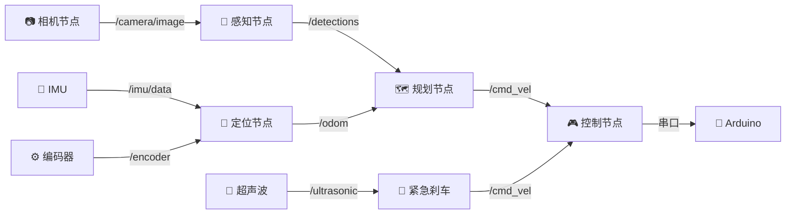

# 🤖 ROS2 入门

> ROS2 (Robot Operating System 2) 是机器人开发的事实标准中间件。对于 L3+ 小车，建议用 ROS2 替代手写串口通信。

---

## 一、为什么需要 ROS2？

### 不用 ROS2（手写架构）

```
摄像头 ──→ 图像处理 ──→ 决策 ──→ 串口 ──→ Arduino
                                   ↑
超声波 ─────────────────────────────┘
IMU ────────────────────────────────┘

问题：
  - 模块紧耦合，改一个影响全部
  - 没有标准的消息格式
  - 调试靠 print，没有可视化工具
  - 多传感器时间同步要手写
```

### 用 ROS2（标准架构）

```
┌─────────┐    /camera/image    ┌──────────┐
│ 相机节点 │ ──────────────────→ │ 感知节点  │
└─────────┘                     └────┬─────┘
                                     │ /perception/obstacles
┌─────────┐    /imu/data             ↓
│ IMU节点  │ ────────────────→ ┌──────────┐
└─────────┘                    │ 规划节点  │
                               └────┬─────┘
┌─────────┐    /ultrasonic          │ /control/cmd
│ 超声波   │ ────────────────→       ↓
└─────────┘                    ┌──────────┐    串口
                               │ 控制节点  │ ──────→ Arduino
                               └──────────┘

ROS2 提供：
  - 发布/订阅（pub/sub）：节点间松耦合通信
  - 标准消息类型：sensor_msgs/Image, geometry_msgs/Twist
  - 可视化工具：rviz2 (3D 可视化), rqt (调试面板)
  - 录制回放：ros2 bag record (录下所有传感器数据供离线调试)
```

---

## 二、安装 ROS2

### Ubuntu 22.04 + ROS2 Humble（推荐）

```bash
# 1. 设置 locale
locale  # 确保是 en_US.UTF-8

# 2. 添加 ROS2 源
sudo apt update && sudo apt install curl gnupg lsb-release
sudo curl -sSL https://raw.githubusercontent.com/ros/rosdistro/master/ros.key \
    -o /usr/share/keyrings/ros-archive-keyring.gpg
echo "deb [arch=$(dpkg --print-architecture) signed-by=/usr/share/keyrings/ros-archive-keyring.gpg] \
    http://packages.ros.org/ros2/ubuntu $(lsb_release -cs) main" \
    | sudo tee /etc/apt/sources.list.d/ros2.list > /dev/null

# 3. 安装
sudo apt update
sudo apt install ros-humble-desktop python3-colcon-common-extensions

# 4. 配置环境（加入 ~/.bashrc）
echo "source /opt/ros/humble/setup.bash" >> ~/.bashrc
source ~/.bashrc
```

### Raspberry Pi / Jetson（资源受限）

装 ROS2 Base（不带 GUI 工具），省空间：

```bash
sudo apt install ros-humble-ros-base
```

---

## 三、核心概念

### 节点 (Node)

每个进程是一个 Node。一个 Node 负责一件事。

```python
# camera_node.py — 发布图像
import rclpy
from rclpy.node import Node
from sensor_msgs.msg import Image
import cv2
from cv_bridge import CvBridge

class CameraNode(Node):
    def __init__(self):
        super().__init__('camera_node')
        self.publisher = self.create_publisher(Image, '/camera/image', 10)
        self.timer = self.create_timer(0.033, self.timer_callback)  # 30Hz
        self.cap = cv2.VideoCapture(0)
        self.bridge = CvBridge()

    def timer_callback(self):
        ret, frame = self.cap.read()
        if ret:
            msg = self.bridge.cv2_to_imgmsg(frame, encoding='bgr8')
            msg.header.stamp = self.get_clock().now().to_msg()
            self.publisher.publish(msg)
```

### 话题 (Topic)

Node 之间通过 Topic 交换数据。命名规范：

| Topic | 消息类型 | 发布者 | 订阅者 |
|-------|----------|--------|--------|
| `/camera/image` | `sensor_msgs/Image` | 相机 Node | 感知 Node |
| `/imu/data` | `sensor_msgs/Imu` | IMU Node | 定位 Node |
| `/ultrasonic` | `sensor_msgs/Range` | 超声波 Node | 紧急刹车 Node |
| `/odom` | `nav_msgs/Odometry` | 里程计 Node | 规划 Node |
| `/cmd_vel` | `geometry_msgs/Twist` | 规划 Node | 控制 Node |

### 小车系统的完整 Topic 图



---

## 四、小车 ROS2 实战

### 控制节点（最简示例）

```python
# control_node.py — 订阅 /cmd_vel，通过串口发给 Arduino
import rclpy
from rclpy.node import Node
from geometry_msgs.msg import Twist
import serial

class ControlNode(Node):
    def __init__(self):
        super().__init__('control_node')
        self.sub = self.create_subscription(
            Twist, '/cmd_vel', self.cmd_callback, 10)
        self.ser = serial.Serial('/dev/ttyUSB0', 115200, timeout=0.1)

    def cmd_callback(self, msg):
        # Twist.linear.x  = 前进速度 (m/s)
        # Twist.angular.z = 转向角速度 (rad/s)
        linear = msg.linear.x
        angular = msg.angular.z
        
        # 换算成 Arduino 可以理解的 steering angle 和 throttle
        steering = 90 + angular * 30  # 粗略映射: 90=正中, ±30
        throttle = int(linear * 100)   # 粗略映射: 0~255
        
        cmd = f"S{int(steering)}T{throttle}\n"
        self.ser.write(cmd.encode())

def main():
    rclpy.init()
    node = ControlNode()
    rclpy.spin(node)
    node.destroy_node()
    rclpy.shutdown()
```

### 感知节点（车道线检测）

```python
# perception_node.py
import rclpy
from rclpy.node import Node
from sensor_msgs.msg import Image
from geometry_msgs.msg import Twist
from cv_bridge import CvBridge
import cv2
import numpy as np

class LaneDetectionNode(Node):
    def __init__(self):
        super().__init__('lane_detection')
        self.bridge = CvBridge()
        self.image_sub = self.create_subscription(
            Image, '/camera/image', self.image_callback, 10)
        self.cmd_pub = self.create_publisher(Twist, '/cmd_vel', 10)

    def image_callback(self, msg):
        frame = self.bridge.imgmsg_to_cv2(msg, 'bgr8')
        
        # === 车道线检测 (简化版) ===
        gray = cv2.cvtColor(frame, cv2.COLOR_BGR2GRAY)
        blur = cv2.GaussianBlur(gray, (5,5), 0)
        edges = cv2.Canny(blur, 50, 150)
        
        # 透视变换 → BEV
        h, w = edges.shape
        src = np.float32([[100,h-120], [540,h-120], [0,h], [w,h]])
        dst = np.float32([[160,0], [480,0], [160,h], [480,h]])
        M = cv2.getPerspectiveTransform(src, dst)
        bev = cv2.warpPerspective(edges, M, (w, h))
        
        # 霍夫线检测
        lines = cv2.HoughLinesP(bev, 1, np.pi/180, 50, 50, 30)
        
        if lines is not None:
            # 计算中线偏离 → 转向角
            left_points, right_points = [], []
            mid = w // 2
            for line in lines:
                x1, y1, x2, y2 = line[0]
                if x1 < mid and x2 < mid:
                    left_points.extend([x1, x2])
                elif x1 > mid and x2 > mid:
                    right_points.extend([x1, x2])
            
            if left_points and right_points:
                left_mean = np.mean(left_points)
                right_mean = np.mean(right_points)
                lane_center = (left_mean + right_mean) / 2
                error = lane_center - mid  # 像素偏移
                
                # 发布控制指令
                twist = Twist()
                twist.linear.x = 0.15  # 恒速
                twist.angular.z = -error / mid * 0.5  # 比例控制
                self.cmd_pub.publish(twist)
```

### launch 文件（一键启动）

```python
# launch/car_bringup.py
from launch import LaunchDescription
from launch_ros.actions import Node

def generate_launch_description():
    return LaunchDescription([
        Node(package='my_car', executable='camera_node'),
        Node(package='my_car', executable='imu_node'),
        Node(package='my_car', executable='ultrasonic_node'),
        Node(package='my_car', executable='perception_node'),
        Node(package='my_car', executable='control_node'),
    ])
```

```bash
# 启动全部
ros2 launch my_car car_bringup.py

# 可视化
rviz2

# 查看话题
ros2 topic list
ros2 topic echo /cmd_vel

# 录制数据（重要！用于离线调试和训练数据采集）
ros2 bag record -a -o my_drive_data
```

---

## 五、ROS2 vs 不用 ROS2 的决策

| 场景 | 建议 |
|------|------|
| L0-L1（纯 Arduino） | ❌ 不需要 ROS2 |
| L2（Pi+OpenCV+串口） | 🤔 可选，手写串口也行 |
| L3（多传感器+AI） | ✅ 强烈推荐 ROS2 |
| L4（端到端+闭环） | ✅ 必须 ROS2 |

> 💡 一旦传感器超过 2 个，ROS2 的 `ros2 bag` 录制回放就值回学习成本——你可以录一圈数据无限回放调试，不用每次跑实车。

---

## 🔗 关联笔记

- [[底盘与电机控制]] — 控制节点通过串口发给 Arduino
- [[传感器集成]] — 传感器数据封装成 ROS2 消息
- [[SLAM与定位]] — ROS2 的 slam_toolbox / cartographer 包
- [[路径规划与控制]] — ROS2 的 nav2 导航栈
