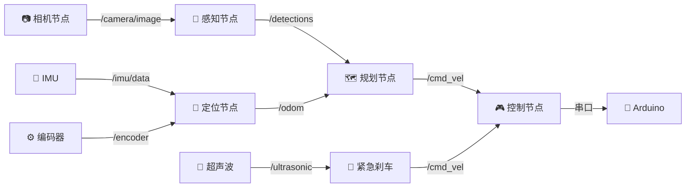

# 🤖 ROS2 入门

> 一句话导读：**ROS2 是机器人开发的事实标准中间件**——把小车从"手写串口的一团线"升级成"发布/订阅的整洁架构"。L3+ 强烈推荐用它替代手写串口通信。本篇讲透为什么需要、核心概念（节点/话题）、小车实战（控制/感知/launch）、以及"什么时候该上 ROS2"。

---

## 🧭 本篇导读

| 项目 | 内容 |
|------|------|
| **这篇学什么** | 为什么需要 ROS2（vs 手写架构）、安装、核心概念（节点/话题/消息类型）、小车实战（控制节点/感知节点/launch/bag）、ROS2 vs 不用 ROS2 的决策 |
| **需要的前置知识** | [[底盘与电机控制]]（串口协议）、[[传感器集成]]（传感器数据）、Python 基础 |
| **学完之后你能** | ① 说出 ROS2 的 4 个核心概念；② 写一个发布/订阅节点；③ 看懂小车完整 Topic 图；④ 判断"我的小车该不该上 ROS2" |
| **预计阅读时间** | 60-90 分钟（边装边写）|

> [!tip] 怎么读本篇
> 本篇是"架构升级课"。**核心对比：手写串口（[[底盘与电机控制]] 第四节）vs ROS2 Topic**——对照着看，你会理解"中间件"解决什么问题。**判断标准先记住：传感器 ≤2 个不用 ROS2，≥3 个强烈推荐**（ros2 bag 录制回放值回学习成本）。

---

## 〇、大白话总览

### ROS2 是什么？——"小车的操作系统"

```
手写架构（L0-L2）:  摄像头→处理→决策→串口→Arduino（一团线，紧耦合）
ROS2 架构（L3+）:   每个功能一个"节点"，节点之间"发消息/收消息"（松耦合）
```

> [!note] 打个比方
> 手写架构像"一家人挤在一个房间里各喊各的"（紧耦合，乱）；ROS2 像"公司各部门用内部邮件沟通"（每个部门独立，通过标准格式邮件（Topic）协作）。
> **"节点 = 部门，话题 = 邮件，消息类型 = 邮件格式"**——ROS2 的核心就这三个词。

### 为什么值得学？（三个"值回票价"的点）

```
① 松耦合:   改一个节点不影响其他（感知换算法，控制不用动）
② 标准格式:  sensor_msgs/Image、geometry_msgs/Twist（业界通用）
③ ros2 bag:  录一圈数据无限回放调试（不用每次跑实车！）
```

---

## 一、为什么需要 ROS2？

### 不用 ROS2（手写架构）

```
摄像头 ──→ 图像处理 ──→ 决策 ──→ 串口 ──→ Arduino
                                   ↑
超声波 ─────────────────────────────┘
IMU ────────────────────────────────┘

问题：
  - 模块紧耦合，改一个影响全部
  - 没有标准的消息格式
  - 调试靠 print，没有可视化工具
  - 多传感器时间同步要手写
```

### 用 ROS2（标准架构）

```
┌─────────┐    /camera/image    ┌──────────┐
│ 相机节点 │ ──────────────────→ │ 感知节点  │
└─────────┘                     └────┬─────┘
                                     │ /perception/obstacles
┌─────────┐    /imu/data             ↓
│ IMU节点  │ ────────────────→ ┌──────────┐
└─────────┘                    │ 规划节点  │
                               └────┬─────┘
┌─────────┐    /ultrasonic          │ /control/cmd
│ 超声波   │ ────────────────→       ↓
└─────────┘                    ┌──────────┐    串口
                               │ 控制节点  │ ──────→ Arduino
                               └──────────┘

ROS2 提供：
  - 发布/订阅（pub/sub）：节点间松耦合通信
  - 标准消息类型：sensor_msgs/Image, geometry_msgs/Twist
  - 可视化工具：rviz2 (3D 可视化), rqt (调试面板)
  - 录制回放：ros2 bag record (录下所有传感器数据供离线调试)
```

> [!warning] 手写 vs ROS2 的核心差异（面试/选型谈资）
> **手写**：模块紧耦合（改一个影响全部）、消息格式自定（不通用）、调试靠 print（没有 rviz 可视化）、时间同步手写。
> **ROS2**：节点松耦合（独立开发）、标准消息（业界通用）、rviz2 可视化 + ros2 bag 回放（调试神器）、内置时间戳。
> **"中间件 = 把通信/同步/可视化这些通用事标准化，让你专注算法"**——这就是 ROS2 的价值。

---

## 二、安装 ROS2

### Ubuntu 22.04 + ROS2 Humble（推荐）

```bash
# 1. 设置 locale
locale  # 确保是 en_US.UTF-8

# 2. 添加 ROS2 源
sudo apt update && sudo apt install curl gnupg lsb-release
sudo curl -sSL https://raw.githubusercontent.com/ros/rosdistro/master/ros.key \
    -o /usr/share/keyrings/ros-archive-keyring.gpg
echo "deb [arch=$(dpkg --print-architecture) signed-by=/usr/share/keyrings/ros-archive-keyring.gpg] \
    http://packages.ros.org/ros2/ubuntu $(lsb_release -cs) main" \
    | sudo tee /etc/apt/sources.list.d/ros2.list > /dev/null

# 3. 安装
sudo apt update
sudo apt install ros-humble-desktop python3-colcon-common-extensions

# 4. 配置环境（加入 ~/.bashrc）
echo "source /opt/ros/humble/setup.bash" >> ~/.bashrc
source ~/.bashrc
```

### Raspberry Pi / Jetson（资源受限）

装 ROS2 Base（不带 GUI 工具），省空间：

```bash
sudo apt install ros-humble-ros-base
```

> [!note] 版本选择（为什么 Humble？）
> **Humble = Ubuntu 22.04 的 LTS 版本**（ROS2 版本和 Ubuntu 版本绑定）——**LTS 配 LTS**（稳定 + 长期支持），社区资料最多。**树莓派/Jetson 装 ros-base（无 GUI）**省空间（rviz 在 PC 上远程看）。

---

## 三、核心概念

### 节点 (Node)

每个进程是一个 Node。一个 Node 负责一件事。

```python
# camera_node.py — 发布图像
import rclpy
from rclpy.node import Node
from sensor_msgs.msg import Image
import cv2
from cv_bridge import CvBridge

class CameraNode(Node):
    def __init__(self):
        super().__init__('camera_node')
        self.publisher = self.create_publisher(Image, '/camera/image', 10)
        self.timer = self.create_timer(0.033, self.timer_callback)  # 30Hz
        self.cap = cv2.VideoCapture(0)
        self.bridge = CvBridge()

    def timer_callback(self):
        ret, frame = self.cap.read()
        if ret:
            msg = self.bridge.cv2_to_imgmsg(frame, encoding='bgr8')
            msg.header.stamp = self.get_clock().now().to_msg()
            self.publisher.publish(msg)
```

> [!note] 节点代码的模式（三件套）
> **① `create_publisher(类型, 话题, 队列)`**——声明"我发什么"；**② `create_timer(间隔, 回调)`**——定时执行（30Hz）；**③ `publish(msg)` + 时间戳**——发消息（**`header.stamp` 是时间同步的基础**，[[传感器集成]] 的时间戳思想在 ROS2 里是内置的）。

### 话题 (Topic)

Node 之间通过 Topic 交换数据。命名规范：

| Topic | 消息类型 | 发布者 | 订阅者 |
|-------|----------|--------|--------|
| `/camera/image` | `sensor_msgs/Image` | 相机 Node | 感知 Node |
| `/imu/data` | `sensor_msgs/Imu` | IMU Node | 定位 Node |
| `/ultrasonic` | `sensor_msgs/Range` | 超声波 Node | 紧急刹车 Node |
| `/odom` | `nav_msgs/Odometry` | 里程计 Node | 规划 Node |
| `/cmd_vel` | `geometry_msgs/Twist` | 规划 Node | 控制 Node |

> [!note] 话题命名规范（工程习惯）
> **`/camera/image` = "谁/什么数据"**（源/内容），消息类型选**标准类型**（Image/Imu/Range/Odometry/Twist）——**"标准消息 = 和别人的包直接对接"**（比如 slam_toolbox 直接消费 `/odom` 和 `/imu/data`，不用你写转换）。

### 小车系统的完整 Topic 图



> [!warning] 这张图 = 小车系统的"架构图"（面试/理解核心）
> **每个传感器/功能 = 一个节点，数据流 = 话题**：相机→感知、IMU+编码器→定位、感知+定位→规划、规划+紧急刹车→控制、控制→Arduino。**"画得出 Topic 图 = 理解整个小车的架构"**——这也是 [[小车项目总览]] 五层架构的"通信视图"。

---

## 四、小车 ROS2 实战

### 控制节点（最简示例）

```python
# control_node.py — 订阅 /cmd_vel，通过串口发给 Arduino
import rclpy
from rclpy.node import Node
from geometry_msgs.msg import Twist
import serial

class ControlNode(Node):
    def __init__(self):
        super().__init__('control_node')
        self.sub = self.create_subscription(
            Twist, '/cmd_vel', self.cmd_callback, 10)
        self.ser = serial.Serial('/dev/ttyUSB0', 115200, timeout=0.1)

    def cmd_callback(self, msg):
        # Twist.linear.x  = 前进速度 (m/s)
        # Twist.angular.z = 转向角速度 (rad/s)
        linear = msg.linear.x
        angular = msg.angular.z
        
        # 换算成 Arduino 可以理解的 steering angle 和 throttle
        steering = 90 + angular * 30  # 粗略映射: 90=正中, ±30
        throttle = int(linear * 100)   # 粗略映射: 0~255
        
        cmd = f"S{int(steering)}T{throttle}\n"
        self.ser.write(cmd.encode())

def main():
    rclpy.init()
    node = ControlNode()
    rclpy.spin(node)
    node.destroy_node()
    rclpy.shutdown()
```

> [!note] 控制节点 = [[底盘与电机控制]] 串口协议的"ROS2 版"
> **上游发 Twist（m/s + rad/s 标准单位）→ 控制节点换算成 Arduino 的 S/T 命令 → 串口发出**——**"ROS2 里跑标准单位，到 Arduino 再转 PWM"**（Twist 是业界标准，别的节点/工具都能发）。**`/cmd_vel` 是 ROS2 的"通用油门踏板"**（导航栈、手柄、你写的节点都能发它）。

### 感知节点（车道线检测）

```python
# perception_node.py
import rclpy
from rclpy.node import Node
from sensor_msgs.msg import Image
from geometry_msgs.msg import Twist
from cv_bridge import CvBridge
import cv2
import numpy as np

class LaneDetectionNode(Node):
    def __init__(self):
        super().__init__('lane_detection')
        self.bridge = CvBridge()
        self.image_sub = self.create_subscription(
            Image, '/camera/image', self.image_callback, 10)
        self.cmd_pub = self.create_publisher(Twist, '/cmd_vel', 10)

    def image_callback(self, msg):
        frame = self.bridge.imgmsg_to_cv2(msg, 'bgr8')
        
        # === 车道线检测 (简化版) ===
        gray = cv2.cvtColor(frame, cv2.COLOR_BGR2GRAY)
        blur = cv2.GaussianBlur(gray, (5,5), 0)
        edges = cv2.Canny(blur, 50, 150)
        
        # 透视变换 → BEV
        h, w = edges.shape
        src = np.float32([[100,h-120], [540,h-120], [0,h], [w,h]])
        dst = np.float32([[160,0], [480,0], [160,h], [480,h]])
        M = cv2.getPerspectiveTransform(src, dst)
        bev = cv2.warpPerspective(edges, M, (w, h))
        
        # 霍夫线检测
        lines = cv2.HoughLinesP(bev, 1, np.pi/180, 50, 50, 30)
        
        if lines is not None:
            # 计算中线偏离 → 转向角
            left_points, right_points = [], []
            mid = w // 2
            for line in lines:
                x1, y1, x2, y2 = line[0]
                if x1 < mid and x2 < mid:
                    left_points.extend([x1, x2])
                elif x1 > mid and x2 > mid:
                    right_points.extend([x1, x2])
            
            if left_points and right_points:
                left_mean = np.mean(left_points)
                right_mean = np.mean(right_points)
                lane_center = (left_mean + right_mean) / 2
                error = lane_center - mid  # 像素偏移
                
                # 发布控制指令
                twist = Twist()
                twist.linear.x = 0.15  # 恒速
                twist.angular.z = -error / mid * 0.5  # 比例控制
                self.cmd_pub.publish(twist)
```

> [!note] 感知节点 = [[传感器集成]] 管线 + ROS2 封装
> **订阅图像 → 灰度/边缘/透视变换（伪 BEV）→ 霍夫找线 → 算中线偏移 → 发布 Twist**——**就是 [[传感器集成]] 第一节管线的"ROS2 化"**（输入从摄像头变成 Topic，输出从 print 变成 `/cmd_vel`）。**`twist.angular.z = -error/mid*0.5` = 比例控制（P 控制）**——[[底盘与电机控制]] PID 的"P 先行"版本。

### launch 文件（一键启动）

```python
# launch/car_bringup.py
from launch import LaunchDescription
from launch_ros.actions import Node

def generate_launch_description():
    return LaunchDescription([
        Node(package='my_car', executable='camera_node'),
        Node(package='my_car', executable='imu_node'),
        Node(package='my_car', executable='ultrasonic_node'),
        Node(package='my_car', executable='perception_node'),
        Node(package='my_car', executable='control_node'),
    ])
```

```bash
# 启动全部
ros2 launch my_car car_bringup.py

# 可视化
rviz2

# 查看话题
ros2 topic list
ros2 topic echo /cmd_vel

# 录制数据（重要！用于离线调试和训练数据采集）
ros2 bag record -a -o my_drive_data
```

> [!warning] `ros2 bag` = 小车的"行车记录仪"（为什么值回学习成本）
> **录一圈数据（所有话题）→ 离线无限回放调试**——不用每次跑实车就能测新算法；**还是 [[端到端小车实战]] 数据采集的进阶版**（bag 里有图像 + 控制量 + 时间戳，行为克隆数据直接能标）。**"bag = 数据闭环的传感器侧"**（[[数据闭环总览]] 的采集环节）。

---

## 五、ROS2 vs 不用 ROS2 的决策

| 场景 | 建议 |
|------|------|
| L0-L1（纯 Arduino） | ❌ 不需要 ROS2 |
| L2（Pi+OpenCV+串口） | 🤔 可选，手写串口也行 |
| L3（多传感器+AI） | ✅ 强烈推荐 ROS2 |
| L4（端到端+闭环） | ✅ 必须 ROS2 |

> 💡 一旦传感器超过 2 个，ROS2 的 `ros2 bag` 录制回放就值回学习成本——你可以录一圈数据无限回放调试，不用每次跑实车。

> [!note] 决策标准（面试/选型谈资）
> **"传感器数量"和"是否需要回放"是两个判断维度**：≤2 个传感器 + 单机 → 手写够用（L0-L2）；≥3 个传感器 / 多机 / 需要回放调试 → ROS2（L3+）。**"ROS2 不是越早越好，是复杂度到了才值"**——L0 用 ROS2 是杀鸡用牛刀。

---

## 六、常见误区速查

> [!warning] 新手最常踩的坑
> 1. **L0-L1 就上 ROS2**——复杂度还没到，徒增学习成本；"传感器 ≥3 个再上"。
> 2. **消息类型乱用**——自己定义 String 传图像（应该用 `sensor_msgs/Image`）；**标准类型 = 和别人的包对接**。
> 3. **忘记 `header.stamp` 时间戳**——不带时间戳的消息没法做时间同步（[[传感器集成]] 的同步在 ROS2 里靠 stamp）。
> 4. **把所有逻辑塞进一个节点**——那就退化成"手写架构 + ROS2 外壳"；**一个功能一个节点**（松耦合的意义）。
> 5. **不用 ros2 bag**——录一圈无限回放是 ROS2 最大的调试红利，不用 = 亏。
> 6. **Pi/Jetson 装 desktop 版**——资源受限装 ros-base（无 GUI），rviz 在 PC 远程看。

---

## ✅ 检验自己（自测题）

> [!question] Q1：ROS2 的核心概念是哪几个？用"公司部门"比喻解释。
> 提示：节点/话题/消息。

> [!success]- 参考答案
> 节点（Node）= 部门（一个功能一个节点）；话题（Topic）= 部门间的邮件（发布/订阅通信）；消息类型（Message）= 邮件格式（标准类型如 Image/Twist）。松耦合 = 部门独立开发，通过标准格式协作——改一个节点不影响其他。这就是 ROS2 替代"手写串口一团线"的价值。

> [!question] Q2：手写架构和 ROS2 架构的核心差异？ROS2 解决了哪四个问题？
> 提示：耦合/格式/调试/同步。

> [!success]- 参考答案
> ① 松耦合：手写模块紧耦合（改一个影响全部），ROS2 节点独立；② 标准消息：手写格式自定不通用，ROS2 用 sensor_msgs/geometry_msgs（业界标准）；③ 调试工具：手写靠 print，ROS2 有 rviz2 可视化 + ros2 bag 录制回放；④ 时间同步：手写要自己做，ROS2 内置 header.stamp 时间戳。

> [!question] Q3：画小车的完整 Topic 图（相机→感知→规划→控制）。
> 提示：数据流。

> [!success]- 参考答案
> 相机→`/camera/image`→感知；IMU→`/imu/data`、编码器→`/encoder`→定位；感知→`/detections`、定位→`/odom`→规划；规划→`/cmd_vel`、超声波→`/ultrasonic`→紧急刹车→`/cmd_vel`→控制；控制→串口→Arduino。**每个传感器/功能一个节点，数据流 = 话题**——画得出这张图 = 理解小车架构。

> [!question] Q4：`/cmd_vel`（Twist）为什么是"通用油门踏板"？
> 提示：标准单位。

> [!success]- 参考答案
> Twist 用标准单位（linear.x = m/s 前进速度、angular.z = rad/s 转向角速度），是 ROS2 的业界标准控制接口——**手柄、导航栈、你写的任何节点都能发布它，控制节点统一接收**。好处：① 换控制源（手柄→规划栈）不用改控制节点；② 和现有工具（rviz 的 teleop）直接对接。这就是"标准消息"的威力。

> [!question] Q5：什么时候该上 ROS2？判断标准是什么？
> 提示：传感器数量/回放。

> [!success]- 参考答案
> 传感器 ≤2 个 + 单机（L0-L2）→ 手写串口够用；≥3 个传感器 / 多机 / 需要回放调试（L3+）→ 强烈推荐 ROS2。核心判断："**复杂度到了才值**"——ros2 bag 录制回放（录一圈无限回放调试）是最大的性价比点（[[端到端小车实战]] 数据采集也受益）。

---

## 🛠 动手练习

### 练习 1：装 ROS2 + 跑通 talker/listener（60-90 分钟）

按第二节安装 ROS2 Humble（虚拟机/真机皆可），然后：
1. 跑通官方 talker/listener 示例（`ros2 run demo_nodes_cpp talker` + `listener`）。
2. `ros2 topic list` / `ros2 topic echo /chatter` 查看话题。
3. 写一个自己的发布节点（发布 `/hello` String），订阅打印。

> [!tip] 这是 ROS2 的"Hello World"
> 跑通"发布/订阅"最小闭环，你就理解了节点+话题的核心机制。**"能自己写一个 pub/sub 节点" = ROS2 入门验收**。

### 练习 2：写控制节点对接 Arduino（60 分钟）

按第四节 control_node，对接你的 Arduino（[[底盘与电机控制]] 的串口协议）：
1. 跑 `ros2 topic pub /cmd_vel geometry_msgs/msg/Twist "{linear: {x: 0.2}}"` 发指令。
2. 观察小车前进；发 `angular.z: 0.5` 观察转向。
3. 用 rqt（或 `ros2 topic echo /cmd_vel`）调试。

> [!tip] 这是"ROS2 控制闭环"的最小验证
> "命令行发 Twist → 小车动" = ROS2 控制链路通了。**对照 [[底盘与电机控制]] 第四节的手写串口**——你会看到"同一个协议，两种架构"。

### 练习 3：ros2 bag 录制回放（可选，30 分钟）

1. 跑小车跑一圈，`ros2 bag record -a` 录数据。
2. `ros2 bag info` 看话题列表。
3. `ros2 bag play` 回放，`rviz2` 看图像话题。
4. 写 3 句总结：bag 对调试和 [[端到端小车实战]] 数据采集的价值。

> [!tip] 这是 ROS2 "值回票价"的验证
> 录一圈无限回放 = 不跑实车也能调试。做完你会理解为什么"传感器 ≥3 个强烈推荐 ROS2"。

---

## ➡️ 下一步学什么

按 [[小车项目总览]] 路径，读完本篇你应该接着：

1. **[[SLAM与定位]]** —— ROS2 的 slam_toolbox/cartographer 包（L3 定位建图）。
2. **[[路径规划与控制]]** —— ROS2 的 nav2 导航栈（L3 路径规划）。
3. **[[端到端小车实战]]** —— bag 数据采集 + 行为克隆（L4）。

> 💡 本篇把 [[底盘与电机控制]]（串口协议）、[[传感器集成]]（传感器数据）、[[小车项目总览]]（五层架构）升级成"ROS2 架构"——L3 起，小车从"手工搭的"变成"专业架构的"。

---

## 相关笔记

- [[底盘与电机控制]] — 控制节点通过串口发给 Arduino
- [[传感器集成]] — 传感器数据封装成 ROS2 消息
- [[SLAM与定位]] — ROS2 的 slam_toolbox / cartographer 包
- [[路径规划与控制]] — ROS2 的 nav2 导航栈
- [[端到端小车实战]] — bag 数据采集
- [[小车项目总览]] — 项目导航
