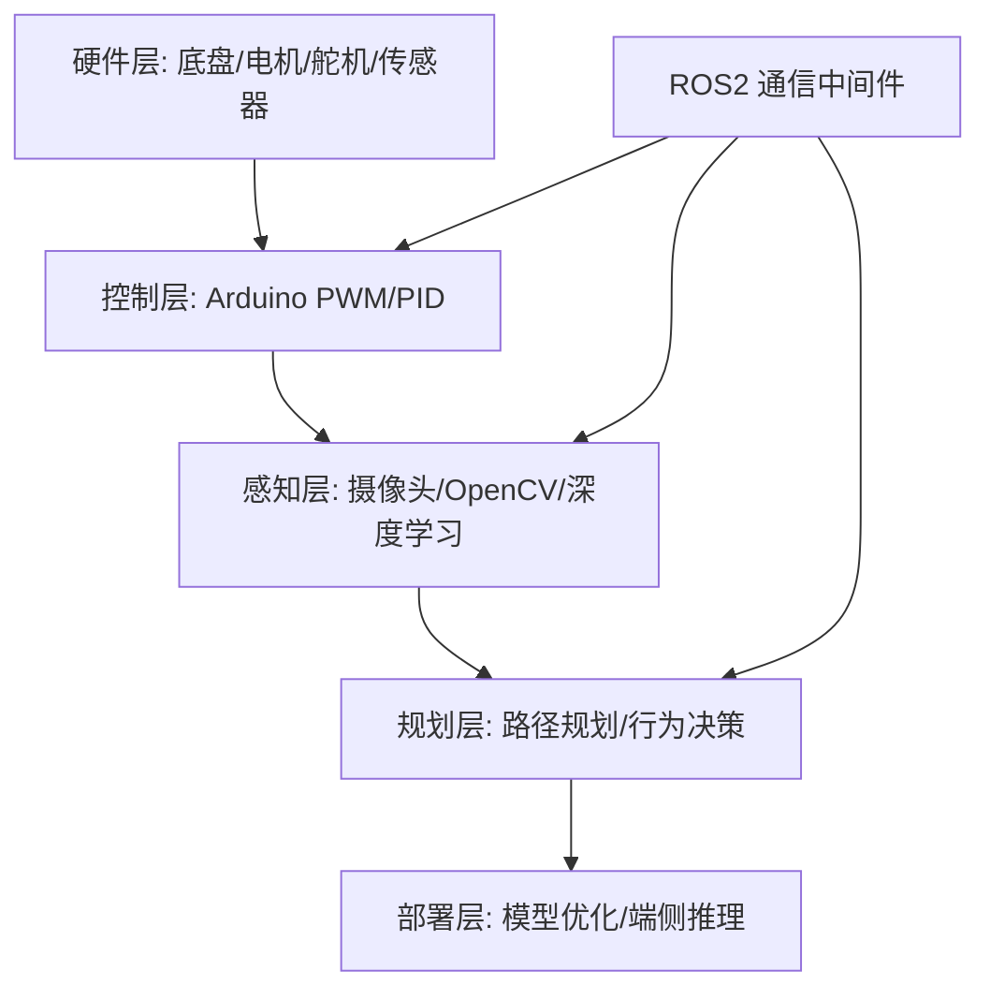

# 🚗 自动驾驶小车项目

> 基于知识库理论，从零构建一辆能跑 AI 模型的自动驾驶小车。
> 按 Level 0 → 4 逐级构建，不要跳级。

---

## 🗺️ 项目架构



---

## 📋 分级任务

| 级别 | 目标 | 硬件投入 | 核心技能 | 对应笔记 |
|:----:|------|----------|----------|----------|
| L0 | 底盘搭建 + 遥控 | ¥200-400 | 电路基础、PWM | [[硬件选型指南]], [[底盘与电机控制]] |
| L1 | 循迹 + 避障 | ¥50 | PID 控制、传感器读取 | [[底盘与电机控制]], [[传感器集成]] |
| L2 | 视觉车道保持 | ¥500 | OpenCV、相机标定 | [[传感器集成]] |
| L3 | 深度学习感知 | ¥1500+ | 模型训练与部署 | [[模型部署]], [[BEV感知全景]] |
| L4 | 端到端行为克隆 | ¥3000+ | Data Engine、闭环测试 | [[端到端小车实战]], [[端到端自动驾驶概览]] |

---

## 📂 笔记索引

### 🛠 硬件 & 控制
- [[硬件选型指南]] — 底盘、主控、传感器、电源全对比
- [[底盘与电机控制]] — Arduino PWM、PID 调参、舵机控制
- [[传感器集成]] — 摄像头/超声波/IMU/编码器驱动与数据融合

### 🤖 机器人中间件
- [[ROS2入门]] — ROS2 核心概念与小车通信架构

### 🗺️ 定位与规划
- [[SLAM与定位]] — Cartographer、ORB-SLAM、里程计融合
- [[路径规划与控制]] — A*、RRT、Pure Pursuit、MPC

### 🧠 AI 部署
- [[模型部署]] — TensorRT、ONNX、Jetson 推理优化
- [[端到端小车实战]] — 行为克隆完整流水线

---

## 🔗 与知识库的关联

| 小车项目概念 | 对应知识库理论 |
|---|---|
| 透视变换 → 伪 BEV | [[BEV感知全景]]、[[3D视觉与投影几何]] |
| 相机目标检测 | [[计算机视觉基础]] |
| 超声波 + 相机融合 | [[多传感器融合基础]] |
| 行为克隆 | [[端到端自动驾驶概览]]、[[UniAD详解]] |
| 占据栅格避障 | [[占据网络与GOD]] |
| 数据采集与标注 | [[数据闭环总览]]、[[数据挖掘与自动标注]] |
| 模型量化部署 | [[模型训练与微调]] |

---

## 🎯 推荐启动路径

```
Week 1-2: 淘宝下单底盘套件 → 跑通 L0（蓝牙遥控）
Week 3-4: 加红外 + 超声波 → 完成 L1（自动循迹避障）
Week 5-8: 加树莓派 + 摄像头 → 完成 L2（视觉车道保持）
Week 9-14: 上 Jetson + YOLO → 完成 L3（AI 感知）
Week 15+: 采集数据 + 训练端到端 → 完成 L4（终极 demo）
```

> 💡 **每完成一级，在 [[学习计划]] 里打勾，并写一篇每日记录总结踩坑经验。**
