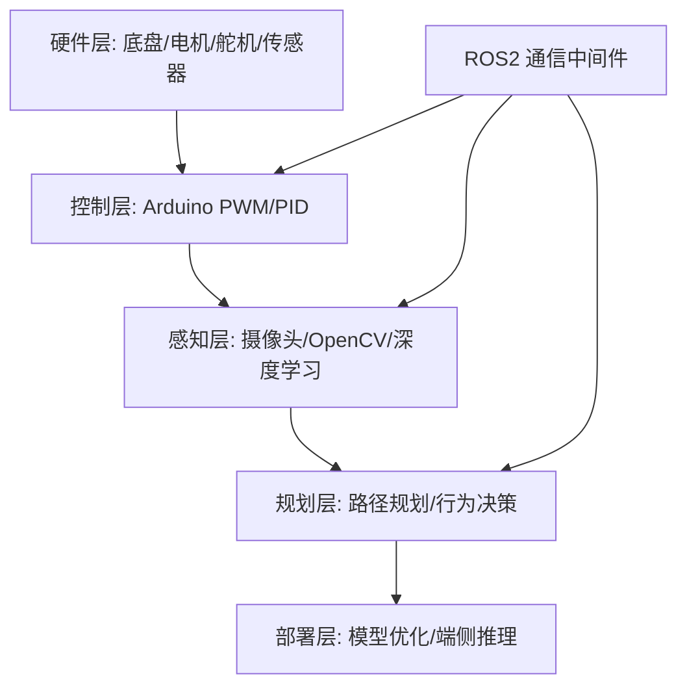

# 🚗 自动驾驶小车项目

> 一句话导读：这是全知识库的"动手篇"——**把前面 20+ 篇理论笔记（CNN、BEV、端到端、部署）变成一辆能跑的自动驾驶小车**。按 Level 0 → 4 逐级构建，不跳级。

---

## 🧭 本篇导读

| 项目 | 内容 |
|------|------|
| **这篇学什么** | 小车项目的整体架构（硬件/控制/感知/规划/部署）、L0-L4 分级任务、各篇笔记的索引、与知识库理论的对应关系、推荐启动路径 |
| **需要的前置知识** | 任意 1-2 篇理论笔记即可起步（L0 不需要任何 AI 知识） |
| **学完之后你能** | ① 画出小车项目的五层架构；② 说出 L0-L4 每一级的目标/硬件/技能；③ 知道每级该读哪篇笔记；④ 制定自己的 15 周启动计划 |
| **预计阅读时间** | 30-45 分钟（本篇是地图，不是教程） |

> [!tip] 怎么读本篇
> 本篇是**项目导航页**（类似 [[000-知识库地图]] 之于全库）。先通读建立全局观，然后**照着 L0 开始动手**——不要读完再动手，**边做边读**对应的笔记（[[硬件选型指南]] → [[底盘与电机控制]] → ...）。

---

## 〇、大白话总览

### 这个项目在做什么？

把知识库里学的"量产自动驾驶"（华为 GOD、UniAD、BEV...）**等比缩小 1000 倍**，用一辆几百块钱的小车跑通同一个逻辑：

```
量产车:  6 相机 + LiDAR → BEV → 规划 → 控制   （几百万成本）
小车:    1 摄像头 + 超声波 → OpenCV/CNN → 决策 → PWM   （几百块成本）
```

**本质一样，规模不同**——你在小车上学到的每一个坑（数据采集、分布漂移、部署延迟），都是量产车工程师踩过的坑。

> [!note] 打个比方
> 学游泳不能只看视频（理论笔记），必须下水（动手项目）。**小车 = 你的"游泳池"**——安全、便宜、可以随便犯错。L0-L4 就是"浅水区 → 深水区"的递进。

### 五层架构（和量产车一一对应）

```
硬件层 (底盘/电机/舵机/传感器)     ← 传感器硬件
控制层 (Arduino PWM/PID)          ← 底层控制
感知层 (摄像头/OpenCV/深度学习)    ← GOD/BEV 感知
规划层 (路径规划/行为决策)          ← PDP 规划
部署层 (模型优化/端侧推理)          ← TensorRT 部署
        └── ROS2 通信中间件贯穿 ←──┘
```

---

## 🗺️ 项目架构



> [!note] 每层的"大脑"不同（重点理解）
> - **控制层 = Arduino**（单片机）：反应快、实时性强，管"轮子怎么转"（PWM/PID）。
> - **感知/规划层 = 树莓派/Jetson**（Linux 主机）：算力强，跑 OpenCV/AI 模型，管"看到了什么、怎么走"。
> - **ROS2**：串起所有层的"神经系统"（节点间通信）。
> **分工逻辑**：慢速的复杂计算（AI）在主机，快速的低层控制（PWM）在单片机——和量产车"车规芯片 + 域控制器"的分层一模一样。

---

## 📋 分级任务（L0 → L4）

| 级别 | 目标 | 硬件投入 | 核心技能 | 对应笔记 |
|:----:|------|----------|----------|----------|
| L0 | 底盘搭建 + 遥控 | ¥200-400 | 电路基础、PWM | [[硬件选型指南]], [[底盘与电机控制]] |
| L1 | 循迹 + 避障 | ¥50 | PID 控制、传感器读取 | [[底盘与电机控制]], [[传感器集成]] |
| L2 | 视觉车道保持 | ¥500 | OpenCV、相机标定 | [[传感器集成]] |
| L3 | 深度学习感知 | ¥1500+ | 模型训练与部署 | [[模型部署]], [[BEV感知全景]] |
| L4 | 端到端行为克隆 | ¥3000+ | Data Engine、闭环测试 | [[端到端小车实战]], [[端到端自动驾驶概览]] |

> [!note] 每一级"不跳级"的原因（重要！）
> - **L0 是地基**：不会 PWM/PID，后面所有控制都是空中楼阁。
> - **L1 学"控制"**：循迹避障让你理解"传感器 → 决策 → 执行"的闭环（这是自动驾驶的最小骨架）。
> - **L2 学"视觉"**：车道保持 = 用图像做控制（OpenCV），为 L3 的深度学习铺垫。
> - **L3 学"AI"**：YOLO 检测 = [[计算机视觉基础]] 的实战，部署 = [[模型部署]] 的实战。
> - **L4 学"端到端"**：行为克隆 = [[端到端自动驾驶概览]] 的实战——**你在小车上学到的 distribution shift，和量产车一模一样**。
> **跳级的代价**：L3 不会部署 → L4 模型跑不起来。**每级都是下一级的"前置知识"。**

---

## 📂 笔记索引

### 🛠 硬件 & 控制
- [[硬件选型指南]] — 底盘、主控、传感器、电源全对比
- [[底盘与电机控制]] — Arduino PWM、PID 调参、舵机控制
- [[传感器集成]] — 摄像头/超声波/IMU/编码器驱动与数据融合

### 🤖 机器人中间件
- [[ROS2入门]] — ROS2 核心概念与小车通信架构

### 🗺️ 定位与规划
- [[SLAM与定位]] — Cartographer、ORB-SLAM、里程计融合
- [[路径规划与控制]] — A*、RRT、Pure Pursuit、MPC

### 🧠 AI 部署
- [[模型部署]] — TensorRT、ONNX、Jetson 推理优化
- [[端到端小车实战]] — 行为克隆完整流水线

---

## 🔗 与知识库的关联（"小车上学的 = 量产车用的"）

| 小车项目概念 | 对应知识库理论 |
|---|---|
| 透视变换 → 伪 BEV | [[BEV感知全景]]、[[3D视觉与投影几何]] |
| 相机目标检测 | [[计算机视觉基础]] |
| 超声波 + 相机融合 | [[多传感器融合基础]] |
| 行为克隆 | [[端到端自动驾驶概览]]、[[UniAD详解]] |
| 占据栅格避障 | [[占据网络与GOD]] |
| 数据采集与标注 | [[数据闭环总览]]、[[数据挖掘与自动标注]] |
| 模型量化部署 | [[模型训练与微调]] |

> [!note] 这张表的用法
> 做到哪一级，就去读对应的理论笔记。**"动手时带着理论、读理论时想着小车"**——双向印证，知识才能真正"长"在身上。

---

## 🎯 推荐启动路径

```
Week 1-2: 淘宝下单底盘套件 → 跑通 L0（蓝牙遥控）
Week 3-4: 加红外 + 超声波 → 完成 L1（自动循迹避障）
Week 5-8: 加树莓派 + 摄像头 → 完成 L2（视觉车道保持）
Week 9-14: 上 Jetson + YOLO → 完成 L3（AI 感知）
Week 15+: 采集数据 + 训练端到端 → 完成 L4（终极 demo）
```

> 💡 **每完成一级，在 [[学习计划]] 里打勾，并写一篇每日记录总结踩坑经验。**

> [!warning] 三个"预算陷阱"（新手必看）
> 1. **L0-L1 别买贵**：底盘 + Arduino + 传感器 ≈ ¥300 足够（L1 只要加 ¥50 的红外/超声波）。
> 2. **L2 才需要"主机"**：树莓派 4B（或二手）即可，别一上来就买 Jetson。
> 3. **L3-L4 再考虑算力**：Jetson Nano/Orin Nano 按需购买。**预算跟着级别走，别一步到位**（一步到位往往吃灰）。

---

## 六、常见误区速查

> [!warning] 新手最常踩的坑
> 1. **跳级**：上来就搞"端到端"（L4），结果 PWM 都不会——**L0-L1 的"无聊"是必须的**。
> 2. **一次买齐**：预算一步到位买 Jetson，结果 L0-L2 根本用不上——**按级别买**。
> 3. **只动手不读笔记**：代码能跑但不懂原理（照抄）——**每个级别配一篇理论笔记**。
> 4. **只读笔记不动手**：理论全懂但一动手就懵——**边做边学**。
> 5. **忽视记录**：不写每日记录 → 踩过的坑下次再踩——**踩坑笔记是最宝贵的资产**。

---

## ✅ 检验自己（自测题）

> [!question] Q1：画出小车的五层架构，并说明每层用什么硬件/技术。
> 提示：硬件/控制/感知/规划/部署 + ROS2。

> [!success]- 参考答案
> 硬件层（底盘、电机、舵机、传感器）→ 控制层（Arduino、PWM/PID）→ 感知层（树莓派/Jetson、摄像头/OpenCV/深度学习）→ 规划层（路径规划、行为决策）→ 部署层（模型优化、端侧推理），ROS2 作为通信中间件贯穿各层。和量产车对应：传感器硬件 / 车规 MCU / 域控制器感知 / 规划决策 / 部署优化。

> [!question] Q2：L0-L4 每一级的目标和"为什么不能跳级"？
> 提示：地基/控制/视觉/AI/端到端。

> [!success]- 参考答案
> L0 底盘遥控（地基：电路/PWM）；L1 循迹避障（控制：传感器→决策→执行的最小闭环）；L2 视觉车道保持（视觉：OpenCV 图像控制）；L3 深度学习感知（AI：YOLO 训练部署）；L4 端到端行为克隆（端到端：数据采集→训练→闭环）。不跳级因为每级都是下一级的前置：不会 PWM 控制不了电机，不会 OpenCV 看不懂图像，不会部署模型跑不起来。

> [!question] Q3：小车项目的"控制层"和"感知层"为什么用不同的设备？
> 提示：实时性 vs 算力。

> [!success]- 参考答案
> 控制层用 Arduino（单片机）：需要毫秒级实时响应（PWM 信号），且任务简单（不需要复杂计算）。感知/规划层用树莓派/Jetson（Linux 主机）：需要跑 OpenCV/AI 模型（算力强），但不需要每毫秒响应。分工逻辑：慢速复杂计算（AI）在主机，快速低层控制（PWM）在单片机——和量产车"MCU + 域控制器"分层一致。

> [!question] Q4：小车上的"行为克隆"（L4）对应量产车的什么概念？你会在小车上亲身体验到什么量产问题？
> 提示：端到端、分布漂移。

> [!success]- 参考答案
> 对应量产车的端到端自动驾驶（[[端到端自动驾驶概览]]）——NVIDIA DAVE-2 是最早的端到端驾驶系统。在小车上你会亲身体验：开环训练 loss 很低但闭环跑起来会"越偏越歪"（Distribution Shift）、直行数据多转弯数据少导致模型学不会转弯（数据不平衡）——这些都是量产端到端团队真实面对的工程问题，只是规模缩小了 1000 倍。

---

## 🛠 动手练习

### 练习 1：制定你的 15 周计划（20 分钟）

基于"推荐启动路径"，结合你的预算和每周可用时间，写一份个人计划：
1. 每周的目标（哪一级、哪个子任务）。
2. 预算分配（L0-L2 多少钱、L3-L4 预留多少）。
3. 每级的"验收标准"（怎么算完成？如 L1 = "小车能沿黑线完整跑一圈"）。

> [!tip] 验收标准很重要
> "完成 L1"不是"代码能跑"，而是"小车能稳定沿黑线跑一圈不脱轨"。**量化的验收标准 = 学习闭环的"自测题"**。

### 练习 2：画"小车 = 量产车"对照图（20 分钟）

用 Excalidraw 画一张对照图：左边量产车 pipeline（传感器→GOD→PDP→CAS），右边小车 pipeline（摄像头→OpenCV/CNN→决策→PWM），用虚线连接对应模块。

> [!tip] 画完自问
> ① 小车缺了量产车的哪层？（CAS 安全兜底——小车没有！想想为什么可以没有）② 哪层最像？（行为克隆的分布漂移问题一模一样）

### 练习 3：写"项目启动清单"（可选，30 分钟）

写一份"开始 L0 前必做的 5 件事"清单（比如：① 确认工作台空间 ② 下单清单 ③ 安装 Arduino IDE ④ 找一个可以画线的场地 ⑤ 定好每周固定时间）。贴在你的 [[2026-08-20]] 或项目笔记里。

> [!tip] 启动清单防"拖延到吃灰"
> 大多数小车项目死在"买完就吃灰"——不是因为难，是因为没计划。**先写清单再下单**，成功率翻倍。

---

## ➡️ 下一步学什么

按项目路径，读完本篇你应该接着：

1. **[[硬件选型指南]]** —— L0 第一步：买什么、多少钱、怎么接（照着下单）。
2. **[[底盘与电机控制]]** —— L0/L1 核心：让轮子转起来、PID 调参。
3. **[[本地训练方案]]** —— 想先用仿真/公开数据练 AI 技能：本地环境搭建 + 5 个实验。
4. **[[端到端小车实战]]** —— L4 终极目标：行为克隆完整流水线。

> 💡 动手建议：**本周先下单 L0 套件**（底盘+Arduino），同时读 [[硬件选型指南]]。硬件在路上时读 [[底盘与电机控制]]——**到货即开干，无缝衔接**。

---

## 相关笔记

- [[硬件选型指南]] — L0 起步
- [[底盘与电机控制]] — L0/L1 控制
- [[传感器集成]] — L1/L2 传感器
- [[ROS2入门]] — 通信架构
- [[SLAM与定位]] — 进阶定位
- [[路径规划与控制]] — 进阶规划
- [[模型部署]] — L3 部署
- [[端到端小车实战]] — L4 端到端
- [[本地训练方案]] — 本地 AI 实验
