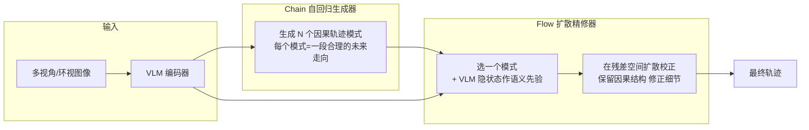

# 📄 论文解读：ChainFlow-VLA（因果流规划：Chain 生成 + Flow 精修）

> 一句话导读：**"自回归负责想因果，扩散负责改轨迹"**——ChainFlow-VLA 把 **AR 因果生成** 和 **扩散全局精修** 统一进一个框架，用 VLM 语义先验做桥梁，NAVSIM v1 拿到 **94.85 PDMS（SOTA，逼近人类水平 94.8）**。这是 [[论文解读-CoWorld-VLA]] 之后，[[端到端前沿2025+]] 里"轨迹生成范式之争"的答案型论文（精读系列第 7 篇）。

---

## 🧭 本篇导读

| 项目 | 内容 |
|------|------|
| **这篇论文** | ChainFlow-VLA: Causal Flow Planning with Vision-Language Models（arXiv 2605.23270）|
| **需要的前置知识** | [[端到端前沿2025+]]（AR vs 扩散之争）、[[VLA入门与智驾应用]]、[[论文解读-CoWorld-VLA]]（对照：世界模型侧 vs 生成范式侧）|
| **读完之后你能** | ① 说清"AR 生成轨迹"和"扩散生成轨迹"各自的病；② 讲出 Chain+Flow 两段式怎么互补；③ 把 NAVSIM 分数放进语境（94.85 已接近人类 94.8）|
| **预计阅读时间** | 论文 30–45 分钟 + 本篇 15 分钟 |

> [!tip] 怎么读这篇论文
> 先看 **Abstract + Figure 1/2**（两段式架构图）抓直觉 → 再读第 3 节方法（Chain 的因果模式 + Flow 的残差校正）→ 公式可先跳过 → 最后看实验结果表（NAVSIM 分数与消融）。

---

## 基本信息

- **论文**: ChainFlow-VLA: Causal Flow Planning with Vision-Language Models
- **作者/机构**: Wang 等（具体单位以原文为准）
- **发表**: arXiv 2026-05（2605.23270）
- **链接**: [arXiv](https://arxiv.org/abs/2605.23270) ｜ [Semantic Scholar](https://www.semanticscholar.org/paper/ChainFlow-VLA%3A-Causal-Flow-Planning-with-Models-Wang-Wang/dcbbdfbf1baa643878da978fba9298f5fd0a5e69)
- **代码**: 论文称开源在即（以原文链接为准）

> [!warning] 阅读诚实声明
> 本篇为**方向性解读**（基于完整摘要 + 标题 + 架构描述），模块内部实现细节**以原文为准**，已列入"待深入理解的问题"。

---

## 核心问题

**一句话：轨迹生成有两条路，各自有治不好的病——能不能合体？**

- **自回归（AR）生成**：像写作文，一句一句"预测下一步"（因果分解，能感知交互）。病：**错误会累积**（写错一句，后面全歪），全局结构不是最优。
- **扩散（Diffusion）生成**：像雕塑，从一团噪声"整体塑形"成轨迹（全局优化）。病：**没有显式因果约束**，在交互密集、安全关键的场景下不可靠。

> 之前的做法是"二选一"，本文问：能不能在**同一个概率框架**里既保留因果、又做全局优化？

---

## 方法（大白话版）

**整体直觉：两条生产线接力。**



**三步流程**：

1. **Chain（自回归生成器）**：先一次性生成**一组**离散的"因果轨迹模式"（每个模式是一条符合因果交互的候选走向），把"因果建模"交给 AR。
2. **VLM 隐状态**：视觉语言模型的**隐藏状态**当"语义先验"——它懂场景（这是路口/前车要变道/红灯），给精修指方向。
3. **Flow（扩散精修器）**：挑一个模式，在**残差空间**（只改"偏差点"不动骨架）里扩散校正——既保留 AR 的因果结构，又借扩散做全局微调。

### 关键设计 1：规划 = 模式上的混合分布（mixture over AR-induced modes）

- 不是"生成一条轨迹"，而是"生成几条模式 + 在这些模式上加权"。
- 好处：**歧义场景**（前车可能让也可能不让）能同时表达多种可能，而不是逼模型硬猜一条。

### 关键设计 2：VLM 条件化的残差校正（mode-conditioned correction in residual space）

- Flow 不重新生成整条轨迹，只修正"相对模式的残差"。
- 语义先验（VLM 隐状态）告诉扩散"这里该往左避让"，但因果骨架（模式）不动 → **语义理解和轨迹细节解耦**。

### 关键公式（直觉版）

```
P(轨迹 | 图像) = Σ_模式  P(模式 | 图像) · P(残差 | 模式, VLM隐状态)
```

- `P(模式)`：Chain 生成的可能走向（离散）
- `P(残差)`：Flow 在残差空间的扩散校正（连续、受 VLM 语义引导）
- 直觉：**先选"走哪条路"（离散选择），再修"这条路的具体细节"（连续校正）**——选择和修正分开做，各干各的强项。

---

## 关键结果

| 方法 | NAVSIM v1 PDMS | 说明 |
|------|----------------|------|
| **ChainFlow-VLA（本文）** | **94.85** | SOTA，逼近人类水平 |
| 人类水平 | 94.8 | 论文报告的人类参考值 |
| CoWorld-VLA | 89.8 | 多专家世界模型（不同榜单/赛道，仅作量级参考）|

**读结果的姿势**：
- 94.85 已**超过人类参考值 94.8**，说明"因果+全局"合体的上限很高——但注意榜单口径可能不同，横向对比要谨慎。
- 论文强调在**歧义与长尾场景**鲁棒：这正是"模式混合"设计想解决的（不再硬猜单一轨迹）。
- 消融（若原文有）：重点看"去掉 Chain 只留扩散""去掉 VLM 语义先验"分别掉多少分，能看出哪个部件贡献大。

---

## 面试/讨论追问

> [!question] Q1：自回归生成轨迹和扩散生成轨迹各自的缺点？怎么统一？

> [!success]- 参考答案
> AR 优点是有因果分解、能感知交互，但逐步解码导致**误差累积**、全局结构次优；扩散优点是全局优化、轨迹平滑，但**缺显式因果约束**，交互/安全场景不可靠。统一思路（ChainFlow-VLA）：AR 生成**离散因果模式**负责"选方向"，扩散在**残差空间**负责"精修细节"，VLM 隐状态作语义先验搭桥——两个强项各干各的。（呼应 Q41 的"多专家分工"思想，这里是"生成范式分工"。）

> [!question] Q2：为什么在"残差空间"做扩散校正，而不是直接扩散整条轨迹？

> [!success]- 参考答案
> 直接整条扩散会丢掉 AR 模式里的因果结构（可能改出违反交互关系的轨迹）；在**残差空间**只修"偏离模式的细节"，因果骨架被保留——结构（模式）和细节（残差）解耦，既全局优化又不破坏因果。这也让 VLM 语义先验能精准指方向（"该避让"），而不是从头捏一条轨迹。

> [!question] Q3："模式混合"对驾驶有什么用？

> [!success]- 参考答案
> 场景常有歧义（前车让还是不让、旁边车加速还是减速），单一轨迹是"硬猜"；模式混合让模型**同时表达多种可能走向**并加权，歧义/长尾场景更鲁棒——对应论文强调的 long-tail 鲁棒性，也是落地安全性的加分点。

---

## 与我的研究方向的关系

- **直接落点**：[[端到端前沿2025+]] 的"轨迹生成范式"线——它回答了"AR 还是扩散"之争：**不是二选一，是分工**。
- **知识串联**：VLM 语义先验 ≈ [[VLA入门与智驾应用]] 里 VLA"懂场景"的用法；模式混合 ≈ [[模型架构演进]] 里"混合/专家"思想在规划侧的应用。
- **面试弹药**：把"AR vs 扩散"和 Q41 的"多专家分工"合并成一套回答，能覆盖 2026 前沿题里规划生成类提问。
- **学习计划**：在 [[学习计划]] Phase 4/5 的端到端线路上，本笔记可作为"规划生成范式"节点的补充阅读。

---

## 待深入理解的问题

- [ ] Chain 生成"因果模式"的具体实现（离散候选怎么采样/束搜索？）——需读原文第 3 节
- [ ] "mode-conditioned correction" 的残差空间具体数学形式（需读原文公式）
- [ ] NAVSIM v1 榜单与 CoWorld-VLA 所用榜单口径是否一致（分数对比的严谨性）
- [ ] VLM 隐状态具体取自哪层、怎么注入 Flow（需读原文实现细节）

---

## 相关笔记

- [[端到端前沿2025+]] — 本论文是该笔记"生成范式"节点的核心素材
- [[论文解读-CoWorld-VLA]] — 对照：世界模型侧 vs 生成范式侧两条路线
- [[VLA入门与智驾应用]] — VLM 语义先验的角色
- [[世界模型]] — 交互感知与因果预测的关系
- [[智驾算法面试题库]] — Q41/Q42 面试弹药
