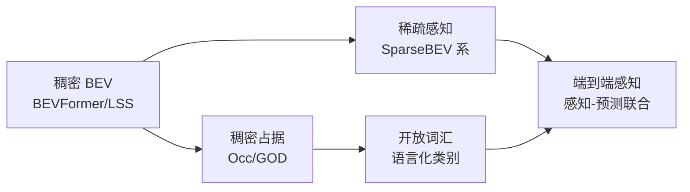

# 感知算法前沿

> 一句话导读：BEV → 占据（[[BEV感知全景]]/[[占据网络与GOD]]）定义了感知的"稠密范式"，2024-2026 的感知在三个方向进化——**稀疏化（SparseBEV：只算有用的）、开放词汇（Open-Vocabulary：不限类别）、感知-预测联合（端到端里的感知新角色）**。本篇是前沿扩展收官篇，补上感知侧的最后一角。

---

## 🧭 本篇导读

| 项目 | 内容 |
|------|------|
| **这篇学什么** | 感知三大前沿：稀疏感知（SparseBEV 系）、开放词汇感知（Open-Vocabulary）、感知-预测联合；与 BEV/Occ 主线的衔接；面试意义 |
| **需要的前置知识** | [[BEV感知全景]]（四路线）、[[BEVFormer详解]]（稠密 BEV 基线）、[[占据网络与GOD]]（占据）、[[端到端前沿2025+]]（端到端趋势） |
| **学完之后你能** | ① 解释"稀疏化"为什么是 BEV 的必然进化；② 说出开放词汇感知的原理与价值；③ 理解端到端时代感知的"角色变化"；④ 面试聊"感知最新方向"有一张完整地图 |
| **更新频率** | 随 [[前沿追踪与面试准备]] 月度机制 |
| **素材截至** | 2026-08（每次更新标注新日期） |

> [!tip] 怎么读这篇
> 本篇是感知方向的"收官地图"。**抓一条主线：感知从"稠密全算"（BEV/Occ）走向"稀疏高效"（SparseBEV）+ "开放泛化"（开词）+"服务端到端"（感知-预测联合）**——每个方向都是对"稠密 BEV 痛点"的回应。

---

## 〇、大白话总览——感知前沿一图流

```
2021-2023 稠密基线:  BEV（200×200 全算）→ 占据（640K 体素全算）
痛点: ① 算力浪费（大部分格子是空的）② 类别封闭（只认训练过的）③ 感知孤岛（只为感知而感知）

2024-2026 三大进化:
① 稀疏感知:    只算"有东西的格子"（SparseBEV）      → 回应"算力浪费"
② 开放词汇:    用"文字描述"代替"固定类别表"        → 回应"类别封闭"
③ 感知-预测联合: 感知直接服务预测/规划（端到端角色）   → 回应"感知孤岛"
```

> [!note] 三条主线的一句话直觉
> - **稀疏化** = "别整张地图都算，只算有东西的地方"（[[模型部署与延迟优化]] 的算力账在感知层的体现）。
> - **开放词汇** = "类别不再是死表，用语言描述任意东西"（GOD 思想的语言化升级）。
> - **感知-预测联合** = "感知不再独立交作业，直接为规划服务"（[[端到端前沿2025+]] 的感知侧）。

---

## 一、主线 1：稀疏感知（SparseBEV 系）——"只算有用的"

### 1.1 痛点：稠密 BEV 的算力浪费

```
BEVFormer: 200×200 = 40000 个 query，每个都做注意力 → 全算
现实:      大部分 BEV 格子是"空"的（没有物体）→ 算力浪费
占据网络:  640K 体素全预测 → 大部分是"free" → 更浪费
```

### 1.2 稀疏化怎么做

```
稠密:  固定网格 → 每个格子都算 → 输出稠密特征
稀疏:  只在"有物体"的位置建 query → 只算这些 → 输出稀疏实例
      （物体位置从哪来？前序检测/提议/注意力自动聚焦）
```

> 代表：SparseBEV、Sparse4D、FlashOcc（[[占据网络与GOD]] 提过）——**"把 40000 个 query 减到几百个实例 query"**。

> [!note] 稀疏感知的本质（面试谈资）
> 稠密 BEV 是"均匀铺网"，稀疏感知是"哪里有东西就在哪建点"——**从"全图扫描"到"目标聚焦"**。好处：算力降一个数量级、天然输出实例级结果（和检测/跟踪衔接顺）。代价：**"物体在哪"依赖前序提议**——提议漏了，感知就漏了（稀疏化把"漏检"从检测层扩散到感知层）。**"稀疏 vs 稠密"= "效率 vs 兜底"的权衡**（和 [[占据网络与GOD]] 的"稠密做安全兜底"呼应——量产常是"稀疏为主 + 稠密兜底"）。

### 1.3 与部署的联系

```
稀疏感知 → 算力降 → 更易上车（[[模型部署与延迟优化]] 的延迟预算）
```

---

## 二、主线 2：开放词汇感知（Open-Vocabulary）——"类别不再封死"

### 2.1 痛点：固定类别表

```
传统检测:  训练 10 个类别（car/pedestrian/...）→ 只能检测这 10 个
现实:      路上有"翻倒的卡车""散落的货物"（不在表里）→ 漏检
GOD 的解法: 不分类别，检测"所有占据空间"（几何兜底）
```

### 2.2 开放词汇的解法：用"文字"当类别

```
开放词汇感知:
  训练: 图像 + 文字描述（"一辆红色的车"）→ 对齐视觉和语言
  推理: 输入任意文字（"一个施工锥桶"）→ 在图像中找到它
       → 类别空间从"固定表"变成"任意文字"
```

> [!note] 开放词汇的本质（和 [[大模型与自动驾驶]] 联动）
> **"类别 = 文字"**——用 CLIP 式图文对齐（[[Transformer架构详解]] 的对比学习）让模型理解"任意描述对应什么视觉模式"。**和 GOD 的区别**：GOD 用"几何兜底"（不管是什么，空间被占就是障碍）；开放词汇用"语言兜底"（不管多罕见，能用文字描述就能找）。**两者互补：GOD 管"不知道是什么的障碍"，开词管"知道描述但没训练过的物体"。**

### 2.3 在智驾的价值

```
长尾障碍:  "散落的纸箱""施工围挡" → 文字描述 → 可检测
交互理解:  "正在过马路的行人" → 文字属性 → 语义更丰富
面试价值:  开放词汇 + GOD = "感知无类别上限"的完整叙事
```

---

## 三、主线 3：感知-预测联合——"感知服务端到端"

### 3.1 背景：端到端时代感知的角色变化

```
传统:  感知独立（输出检测框）→ 交给下游预测/规划（接口丢信息）
端到端: 感知特征直接流向预测/规划（[[UniAD详解]] 的 Query 机制）
2025+: 感知进一步"为任务而设计"（[[端到端前沿2025+]] 的 VLA 化）
```

### 3.2 具体趋势

| 趋势 | 内容 | 代表/关联 |
|------|------|-----------|
| **多任务共享** | 检测/分割/预测共享感知特征 | UniAD、BEVFormer 多任务头 |
| **感知即预测** | 感知输出直接含运动/意图（Occupancy Flow） | 特斯拉 ON（[[占据网络与GOD]]） |
| **语言增强感知** | VLM 参与场景理解 | [[大模型与自动驾驶]]、[[端到端前沿2025+]] |

> [!note] "感知-预测联合"的面试答案
> 感知不再"交作业"（输出框就走），而是**为预测/规划提供"任务导向的特征"**（[[UniAD详解]] 的 Planning-Oriented）——感知的输出形式和粒度由下游需求决定。**"感知的 KPI 从 mAP 变成'规划安全性贡献'"**——这是感知角色最深刻的变化（呼应 [[华为ADS端到端架构]] 的"以规划为导向"）。

---

## 四、感知前沿全景 + 与 BEV/Occ 主线衔接



```
完整叙事（面试用）:
"感知从 2021 的稠密 BEV 走到 2025:
① 稀疏化解决算力浪费（SparseBEV 只算有用的）;
② 开放词汇解决类别封闭（文字当类别）;
③ 感知-预测联合解决感知孤岛（特征直接服务规划）。
方向一致: 更高效、更泛化、更服务下游。"
```

> [!note] 和"端到端前沿"的呼应
> 感知前沿和 [[端到端前沿2025+]] 是同一条进化线：**感知的"高效化"（稀疏）、"泛化"（开词）、"服务化"（联合）正好支撑端到端的"算力、长尾、可解释"三大诉求**——感知和端到端不是两个话题，是一体两面。

---

## 五、常见误区速查

> [!warning] 新手最常踩的坑
> 1. **以为稀疏感知"免费更快"**——稀疏化依赖"提议质量"，提议漏了感知就漏了；量产是"稀疏为主 + 稠密兜底"。
> 2. **混淆 GOD 和开放词汇**——GOD 是"几何兜底"（不管是什么，占据即障碍），开词是"语言兜底"（能用文字描述就能找）——互补不替代。
> 3. **以为开放词汇 = 检测更多类别**——是"类别空间从枚举变成语言"，本质是表示方式的改变（不是把 10 类扩成 100 类）。
> 4. **把感知和端到端割裂**——感知前沿（稀疏/开词/联合）和端到端前沿（VLA/世界模型）是一条进化线，面试要能串。
> 5. **忽略"感知 KPI 的变化"**——端到端时代感知的 KPI 从 mAP 变成"对规划安全的贡献"，这是角色转变的核心。

---

## ✅ 检验自己（自测题）

> [!question] Q1：稠密 BEV 的算力浪费是什么？稀疏感知怎么解决？代价是什么？
> 提示：空格子。

> [!success]- 参考答案
> 稠密 BEV（如 200×200=40000 query）每个格子都做注意力，但大部分格子是空的（无物体）→ 算力浪费；占据网络 640K 体素更浪费。稀疏感知只在"有物体"的位置建 query（SparseBEV/Sparse4D），算力降一个数量级。代价：依赖前序提议质量——提议漏了感知就漏了（漏检扩散）。量产解法："稀疏为主 + 稠密兜底"（呼应占据网络的稠密安全兜底）。

> [!question] Q2：开放词汇感知和 GOD 的区别与互补关系？
> 提示：语言兜底 vs 几何兜底。

> [!success]- 参考答案
> GOD：几何兜底——不管障碍物是什么，空间被占就是障碍（不需要类别概念）。开放词汇：语言兜底——用 CLIP 式图文对齐让模型理解"任意文字描述对应什么视觉模式"，能找"知道描述但没训练过"的物体。互补：GOD 管"不知道是什么的障碍"，开词管"能描述但没训练过的物体"——合起来是"感知无类别上限"的完整叙事。

> [!question] Q3：端到端时代感知的角色发生了什么变化？
> 提示：KPI 变化。

> [!success]- 参考答案
> 传统感知"交作业"（输出框就走），端到端时代感知为下游提供"任务导向特征"（UniAD 的 Planning-Oriented：感知输出形式和粒度由规划需求决定）。最深刻的变化：**感知的 KPI 从 mAP 变成"对规划安全的贡献"**——感知不再独立刷指标，而是服务端到端链路（呼应华为"以规划为导向"）。

> [!question] Q4：稀疏感知为什么能降低部署延迟？
> 提示：算力账。

> [!success]- 参考答案
> 稀疏感知只算"有物体"的位置（几百个实例 query vs 40000 个网格 query），计算量降一个数量级 → 同样的算力预算（[[模型部署与延迟优化]] 的延迟预算）能跑更大的模型或更快的帧率。和"降低分辨率/轻量 Backbone"一样属于"算力效率"类优化，但稀疏化是"结构级"优化（不做无效计算）而非"精度换速度"。

> [!question] Q5：感知前沿和端到端前沿为什么是"一条进化线"？
> 提示：一体两面。

> [!success]- 参考答案
> 感知的"高效化"（稀疏）支撑端到端的实时性、感知的"泛化"（开词）支撑端到端的长尾、感知的"服务化"（感知-预测联合）支撑端到端的可解释与任务导向——**感知前沿正好回应端到端前沿（VLA 化/世界模型/生成式规划）的三大诉求**。所以感知和端到端不是两个话题，是同一进化线的两侧（面试能串起来讲 = 系统认知）。

---

## 🛠 动手练习

### 练习 1：画"感知进化线"（30 分钟）

用 Excalidraw 画感知从 2021 → 2026 的进化线：
1. 稠密 BEV（2021-2023）→ 占据（2023-2024）→ 稀疏（2024-2026）
2. 在每条线旁标注：代表工作、解决的痛点、遗留的问题
3. 用箭头指向"端到端前沿"（[[端到端前沿2025+]]），标注"感知如何服务端到端"

> [!tip] 画完自问
> ① 每步进化解决了上个范式的什么痛点？（算力/类别/孤岛）② 稀疏化把"漏检风险"从哪扩散到哪？（检测层→感知层）③ 这张图和 [[BEV感知全景]] 的四路线图怎么衔接？

### 练习 2：写"感知最新方向"面试答法（45 分钟）

用"事实→主线→观点"框架写 300 字回答"感知算法的最新方向"：
1. 事实：稀疏感知（SparseBEV）、开放词汇、感知-预测联合。
2. 主线：接 [[BEV感知全景]]/[[占据网络与GOD]] 的稠密基线。
3. 观点：感知从"全算/封闭/独立"走向"高效/开放/服务下游"。

> [!tip] 完成标准
> 提到"SparseBEV"能接"算力浪费 vs 提议依赖"；提到"开放词汇"能接"语言兜底 vs GOD 几何兜底"；提到"感知-预测联合"能接"KPI 从 mAP 变成规划贡献"——**每个词都有一条技术线接着**。

### 练习 3：读 SparseBEV 论文（可选，1-2 小时）

打开 SparseBEV 论文（arXiv: 2306.11091）或搜"sparse BEV 感知 解读"，回答：
1. SparseBEV 怎么确定"在哪里建 query"？（提议/锚点）
2. 它和 BEVFormer 的 query 机制有什么本质区别？
3. 稀疏化后检测精度掉了吗？（看消融）

> [!tip] 月度论文精读演练
> 这是 [[前沿追踪与面试准备]] 月度清单的实操。读完写解读存 [[论文索引]]，PDF 存 `Attachments/papers/2026-08/`。

---

## ➡️ 下一步学什么

按 [[前沿追踪与面试准备]] 路线图，读完本篇你应该接着：

1. **[[智驾算法面试题库]]** —— 把感知前沿三方向补进题库。
2. **[[端到端前沿2025+]]** —— 没读先读：感知前沿和端到端前沿是一条线。
3. **[[占据网络与GOD]]** —— 稠密占据基线没读透先回去补。

> 💡 **前沿扩展全部完成（7.1-7.8）！** 你现在有完整的"智驾 + 大模型 + 具身 + Infra"前沿地图——从感知到端到端到训练到部署，面试的每一个方向都有前沿弹药。

---

## 相关笔记

- [[前沿追踪与面试准备]] — 路线图与月度机制
- [[BEV感知全景]] — 稠密 BEV 基线
- [[BEVFormer详解]] — 稠密 query 基线
- [[占据网络与GOD]] — 稠密占据/GOD 基线
- [[端到端前沿2025+]] — 同一进化线
- [[大模型与自动驾驶]] — 开放词汇的技术基础
- [[模型部署与延迟优化]] — 稀疏化的部署价值
- [[智驾算法面试题库]] — 面试应用
