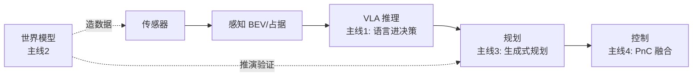

# 端到端前沿 2025+

> 一句话导读：UniAD/VAD（2023）定义了端到端的"感知-规划"范式，2025 年的端到端在四个方向进化——**VLA 化（语言进决策）、世界模型增强（数据引擎）、生成式规划（Diffusion）、规划控制融合（PnC 一体化）**。本篇追踪这四条主线，作为 [[端到端自动驾驶概览]] / [[UniAD详解]] / [[VAD详解]] 的前沿续篇。

---

## 🧭 本篇导读

| 项目 | 内容 |
|------|------|
| **这篇学什么** | 2025 端到端四大主线：VLA 化（Orion/DesEAD/Alpamayo-R1）、世界模型增强（DriveVLA-W0）、生成式规划（GenAD 系）、规划控制融合（PnC 趋势）、全景图与面试用法 |
| **需要的前置知识** | [[端到端自动驾驶概览]]（范式）、[[UniAD详解]]/[[VAD详解]]（2023 基线）、[[VLA入门与智驾应用]]（VLA 底座）、[[世界模型]] |
| **学完之后你能** | ① 说出 2025 端到端四条主线和代表工作；② 解释"VLA 化"和"生成式规划"的本质；③ 面试聊"端到端最新进展"时有一张完整地图 |
| **更新频率** | 随 [[前沿追踪与面试准备]] 月度机制（论文季度精读） |
| **素材截至** | 2026-08（每次更新标注新日期） |

> [!tip] 怎么读这篇
> 本篇是"前沿地图"——**先抓四条主线（一图流），再挑你感兴趣的主线深读**（每个主线都配了代表工作+链接）。读的时候对照你已学透的 UniAD/VAD：**"2023 的范式 + 2025 的进化 = 面试的完整叙事"。**

---

## 〇、大白话总览——2025 端到端一图流

```
2023 基线（[[UniAD详解]]/[[VAD详解]]）:  感知 → 预测 → 规划（神经网络, 无语言）

2025 四大进化:
① VLA 化:        感知 → 语言推理 → 规划     （语言进决策, 可解释）
② 世界模型增强:   世界模型造数据/推演 → 训练/验证（数据引擎）
③ 生成式规划:     Diffusion 生成轨迹          （规划=生成问题）
④ 规划控制融合:   规划+控制一体化             （PnC 融合, 端到端到底）
```

> [!note] 四条主线的一句话直觉
> - **VLA 化** = "给端到端装上会说话的脑子"（[[VLA入门与智驾应用]] 的智驾应用）。
> - **世界模型增强** = "给端到端配一个模拟器"（造数据 + 事前推演）。
> - **生成式规划** = "轨迹不'算'出来，'画'出来"（Diffusion 生成多模态轨迹）。
> - **PnC 融合** = "规划和控制别再分家"（端到端一路管到底）。
> **共同方向：端到端从"感知-规划"走向"感知-推理-生成-控制"的全链路一体化。**

---

## 一、主线 1：VLA 化端到端——"语言进决策"

### 1.1 本质

```
传统端到端:  图像 → 轨迹（黑盒）
VLA 化:      图像 + 语言指令/推理 → 轨迹 + 语言解释（白盒）
```

**VLA 化的核心 = 把 [[VLA入门与智驾应用]] 的架构用到智驾端到端**：语言不只是"解释"，还参与决策（指令输入 + CoT 推理）。

### 1.2 代表工作（2025）

| 工作 | 核心 | 链接 |
|------|------|------|
| **Orion** (IEEE 2025) | 视觉语言指令 → 动作生成（语言作为控制入口） | [IEEE](https://ieeexplore.ieee.org/abstract/document/11445650) |
| **DesEAD** (2025) | 用场景描述（语言）增强端到端驾驶决策 | [IEEE](https://ieeexplore.ieee.org/abstract/document/11423106) |
| **Alpamayo-R1** (NVIDIA 2025) | R1 式推理链 + 动作预测，长尾泛化 | [NVIDIA AVG](https://research.nvidia.com/labs/avg/publication/wang.luo.etal.arxiv2025/) |
| **DriveVLM** (2024 基线) | VLM 场景理解 + 决策建议 | [[大模型与自动驾驶]] |

> [!note] 三个工作的差异（面试谈资）
> - **Orion** = "语言是指令"（人可以用语言指挥车："前方右转"）。
> - **DesEAD** = "语言是增强"（场景描述辅助决策，不是主输入）。
> - **Alpamayo-R1** = "推理是防长尾"（R1 式长链推理覆盖没见过的场景）。
> **共同点：语言/推理成为端到端的一部分**——从"加分项"变成"结构组件"。

---

## 二、主线 2：世界模型增强——"给端到端配模拟器"

### 2.1 两个作用（[[世界模型]] 在端到端的具体化）

```
作用 1 数据引擎:  世界模型合成驾驶数据 → 训练端到端（解决数据饥渴）
作用 2 安全推演:  规划轨迹先在世界模型里模拟 → 拒绝碰撞轨迹（事前验证）
```

### 2.2 代表工作：DriveVLA-W0（2025）

> [DriveVLA-W0: World Models Amplify Data Scaling Law in Autonomous Driving](https://arxiv.org/abs/2510.12796)

- **核心**：用世界模型**生成海量驾驶场景**训练 VLA 智驾模型，放大"数据规模法则"。
- **意义**：端到端/VLA 是"数据饥饿"的（要海量数据），世界模型 = **"数据工厂"**——这是 [[数据闭环总览]]"生成式数据增强"趋势的端到端版落地。
- **技术链条**：世界模型（[[世界模型]] 的 OccWorld/GAIA 系）→ 合成场景 → VLA 训练（[[VLA入门与智驾应用]]）。

> [!warning] 面试怎么聊世界模型增强
> 抓住"**数据规模法则**"这个词：端到端模型的性能随数据规模提升（scaling law），但真实数据有限 → **世界模型是"数据放大镜"**（合成数据补足规模）。**"世界模型不是替代真实数据，是放大真实数据"**——这个定位比"世界模型很酷"深刻得多。

---

## 三、主线 3：生成式规划——"轨迹是画出来的"

### 3.1 本质

```
传统规划:  网络"回归"一条轨迹（输出一个确定答案）
生成式规划: Diffusion/Flow 从噪声"生成"轨迹（输出一个分布，可采样多条）
```

**规划从"预测一个问题"变成"生成一个分布"**——好处：① 多模态（直行/左转都是合理答案，生成式都能表达）；② 更平滑（Diffusion 的逐步去噪天然平滑）。

### 3.2 代表：GenAD（上海 AI Lab，2024）

> GenAD（Generative End-to-End Autonomous Driving）——把端到端规划建模为"生成问题"。

- **核心**：用扩散/生成模型输出轨迹，表达"多种合理驾驶方案"。
- **和 [[VAD详解]] 的关系**：VAD 是"显式规划"（候选采样+评分），GenAD 是"生成式规划"（Diffusion 直接生成）——**"显式"到"生成"的进化**（[[VLA入门与智驾应用]] 3.2 的 Flow Matching 是同一个思想的机器人版）。

> [!note] 生成式规划的价值（面试谈资）
> 传统回归规划给"平均答案"（可能是不安全的折中轨迹）；生成式规划给"分布"（能表达"绕左或绕右都是合理"）→ **多模态规划 + 更符合人类驾驶的多解性**。局限：生成慢（Diffusion 推理步数多）、可解释性弱——"生成式表达力 vs 实时性"是当前权衡。

---

## 四、主线 4：规划控制融合（PnC 一体化）——"端到端管到底"

### 4.1 背景

```
传统: 规划（输出轨迹）→ 控制（跟踪轨迹）两个模块（有接口信息损失）
PnC 融合: 规划+控制一体化（直接输出控制量/轨迹+控制联合优化）
```

### 4.2 趋势

> [聊聊端到端自动驾驶下的规划控制融合趋势](https://blog.csdn.net/cv_autobot/article/details/147913793)（PnC 工程师视角）

- **现状**：大多数端到端（UniAD/VAD）输出"轨迹"，控制还是独立模块（PID/MPC 跟踪）。
- **趋势**：**规划+控制联合优化**——轨迹生成时就把"控制可行性"考虑进去（避免"规划的轨迹控制跟不住"）。
- **面试价值**：PnC 岗是智驾招聘大头，"端到端 + PnC 融合"是 PnC 工程师面试的热点话题。

> [!note] PnC 融合的难点（面试谈资）
> ① 控制是高频（100Hz+），规划是低频（10-20Hz）——**频率解耦**怎么设计？② 控制器有物理约束（转向速率/刹车极限），规划必须考虑——**"规划时要懂控制"**。③ 融合后怎么保证安全兜底（CAS 仍然需要）？**"端到端做决策，PnC 保证物理可行，CAS 兜底安全"**——三层分工是量产共识。

---

## 五、端到端前沿全景图（四条主线怎么串）



```
完整叙事（面试用）:
"2025 年端到端从'感知-规划'走向全链路:
① 语言进决策（VLA 化）→ 可解释;
② 世界模型造数据/推演 → 解决数据饥渴 + 事前验证;
③ 规划变生成（Diffusion）→ 多模态表达;
④ 规划控制融合 → 物理可行。
方向一致: 更聪明、更懂物理、更可解释、更安全。"
```

> [!note] 四条主线的关系
> 不是四个独立方向，是**一个完整链路的四段进化**：VLA 化管"推理"、世界模型管"数据与验证"、生成式规划管"轨迹表达"、PnC 融合管"物理落地"——**合起来 = "端到端 2.0"**。面试能画出这张图并讲清四条线，就是"端到端前沿"的高级认知。

---

## 六、对学习/面试的意义

### 面试必答："端到端自动驾驶的最新进展"

```
答题框架（事实→主线→观点）:
事实: 2025 年端到端出现 VLA 化（Orion/DesEAD）、世界模型增强（DriveVLA-W0）、
      生成式规划（GenAD）、PnC 融合四大趋势
主线: 对应语言进决策/数据引擎/生成表达/物理可行（接本库 UniAD/VAD/世界模型/VLA）
观点: 端到端从"感知-规划"走向"全链路一体化"，量产趋势是"端到端决策 + 规则兜底"
      （华为 GOD+PDP+CAS 就是工程化答案）
```

### 简历/项目谈资

- 如果你做过端到端项目：可以加一句"**关注 VLA 化与生成式规划趋势**"——证明你不是只会跑基线。
- 面试被问"你看过 GenAD 吗"：答"生成式规划，把轨迹当分布生成，和 VAD 的显式规划形成对照"——**一个对比句就过关**。

---

## 七、常见误区速查

> [!warning] 新手最常踩的坑
> 1. **以为"VLA 化"= "VLA 模型"**——VLA 化是"语言进决策"的趋势（Orion/DesEAD 都是轻量语言增强），不一定要上大模型。
> 2. **以为生成式规划 = 新范式**——是"轨迹表达方式"的升级（回归→生成），范式还是端到端；生成式也有回归没有的多模态优势。
> 3. **以为世界模型替代真实数据**——世界模型是"放大"真实数据（scaling law 的补足），不是替代（合成数据有分布偏差）。
> 4. **忽略 PnC 融合的工程难点**——频率解耦/物理约束/安全兜底，融合不是"一个网络"这么简单。
> 5. **把四条主线当独立方向**——是一个链路的四段（推理/数据/表达/落地），面试要能串起来讲。

---

## ✅ 检验自己（自测题）

> [!question] Q1：2025 端到端四大主线是什么？各自代表工作？
> 提示：语言/数据/生成/融合。

> [!success]- 参考答案
> ① VLA 化（语言进决策）：Orion（语言指令→动作）、DesEAD（场景描述增强）、Alpamayo-R1（推理链防长尾）；② 世界模型增强：DriveVLA-W0（WM 合成数据放大 scaling law）；③ 生成式规划：GenAD（Diffusion 生成轨迹）；④ 规划控制融合：PnC 一体化趋势（规划时考虑控制可行性）。共同方向：端到端从"感知-规划"走向全链路一体化。

> [!question] Q2：DriveVLA-W0 的"数据规模法则"是什么意思？
> 提示：WM 是放大镜。

> [!success]- 参考答案
> 端到端/VLA 模型的性能随训练数据规模提升（scaling law），但真实驾驶数据有限。DriveVLA-W0 用世界模型合成海量驾驶场景补足数据规模——**世界模型是"数据放大镜"**（放大真实数据，不是替代：合成数据有分布偏差，需真实数据校准）。这是 [[数据闭环总览]] 生成式增强趋势在端到端的具体落地。

> [!question] Q3：生成式规划（GenAD）和显式规划（VAD）的本质区别？
> 提示：回归 vs 生成。

> [!success]- 参考答案
> VAD 显式规划：采样候选轨迹 + 评分选择（"选"出来的，可解释）。GenAD 生成式规划：用 Diffusion/Flow 从噪声"生成"轨迹分布（"画"出来的，可表达多模态——绕左或绕右都是合理答案）。回归式规划给"平均答案"（可能是不安全的折中），生成式给"分布"（多解性）。代价：生成推理慢、可解释性弱。

> [!question] Q4：PnC 融合的三大工程难点？
> 提示：频率/物理/安全。

> [!success]- 参考答案
> ① 频率解耦：控制高频（100Hz+）vs 规划低频（10-20Hz），怎么设计？② 物理约束：控制器有转向速率/刹车极限，规划必须考虑（"规划时要懂控制"）；③ 安全兜底：融合后 CAS 仍然需要（"端到端做决策，PnC 保物理可行，CAS 兜安全"三层分工是量产共识）。

> [!question] Q5：把四条主线串成"端到端 2.0"的完整叙事。
> 提示：推理/数据/表达/落地。

> [!success]- 参考答案
> ① VLA 化管"推理"（语言进决策，可解释）；② 世界模型管"数据与验证"（合成数据放大规模 + 事前推演）；③ 生成式规划管"轨迹表达"（Diffusion 多模态）；④ PnC 融合管"物理落地"（规划控制一体化）。合起来 = 端到端从"感知-规划"走向"感知-推理-生成-控制"全链路，方向是更聪明、更懂物理、更可解释、更安全。

---

## 🛠 动手练习

### 练习 1：画"端到端前沿全景图"（30 分钟）

用 Excalidraw 画第五节的 mermaid 图（传感器→感知→VLA 推理→生成式规划→PnC 融合 + 世界模型两条虚线），并在每条主线上标：
1. 代表工作（Orion/DriveVLA-W0/GenAD/PnC）
2. 对应的本库基线笔记（[[UniAD详解]]/[[世界模型]]/[[VAD详解]]）

> [!tip] 画完自问
> ① 四条主线各自解决"端到端的什么短板"？（黑盒/数据/多模态/物理可行）② 哪条线离量产最近？（PnC 融合——工程岗已在做）③ 哪条线最前沿？（生成式规划 + VLA 化）

### 练习 2：写"端到端最新进展"面试答法（45 分钟）

用"事实→主线→观点"框架写一段 300 字回答"端到端自动驾驶的最新进展"：
1. 事实：2-3 个 2025 工作（Orion/DriveVLA-W0/GenAD，带一句话）。
2. 主线：接本库的 UniAD/VAD/世界模型/VLA。
3. 观点：端到端 2.0 的方向 + 量产落地形态（端到端决策+规则兜底）。

> [!tip] 完成标准
> 说到"DriveVLA-W0"能接"数据规模法则"，说到"GenAD"能接"回归 vs 生成"——**每个工作都有一条技术主线接着**，面试就不会"只报菜名"。

### 练习 3：精读一篇前沿论文（可选，1-2 小时）

从 Orion / DriveVLA-W0 / Alpamayo-R1 中选一篇，用 [[论文笔记模板]] 写解读：
1. 一句话贡献。
2. 对应本库哪篇笔记的哪个概念。
3. 3 个必背要点。
4. 1 个可质疑点（比如合成数据的分布偏差、推理延迟）。

> [!tip] 月度论文精读的演练
> 这是 [[前沿追踪与面试准备]] 月度清单第 2 步的实操。读完存进 [[论文索引]]，PDF 存 `Attachments/papers/2026-08/`。

---

## ➡️ 下一步学什么

按 [[前沿追踪与面试准备]] 路线图，读完本篇你应该接着：

1. **[[AI-Infra前沿]]** —— 端到端 2.0 的算力底座（生成式规划/VLA 推理都很吃算力）。
2. **[[感知算法前沿]]** —— 端到端的感知侧进化（稀疏/开放词汇感知）。
3. **[[智驾算法面试题库]]** —— 把"端到端四大主线"补进题库。

> 💡 前沿扩展第 5 站完成！你现在有一张"端到端 2025 全景图"——面试聊端到端，从"UniAD 是什么"到"2025 四大主线"都能讲，**前沿认知完整了**。

---

## 相关笔记

- [[前沿追踪与面试准备]] — 路线图与月度机制
- [[端到端自动驾驶概览]] — 范式基线
- [[UniAD详解]] / [[VAD详解]] — 2023 对照
- [[VLA入门与智驾应用]] — 主线 1 的底座
- [[世界模型]] — 主线 2 的底座
- [[大模型与自动驾驶]] — DriveVLM 基线
- [[智驾算法面试题库]] — 面试应用
