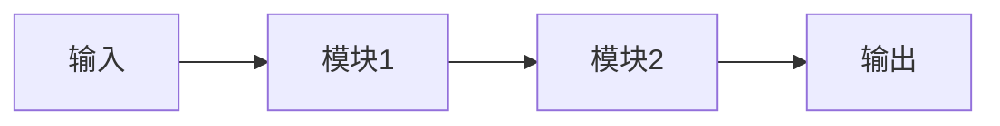

# {{title}}

> 一句话导读：〔用比喻或一句话说清：这篇模型笔记讲什么、为什么值得读〕

---

## 🧭 本篇导读

| 项目 | 内容 |
|------|------|
| **这篇学什么** | 〔核心概念、机制、对比，3-5 条〕 |
| **需要的前置知识** | 〔点名具体笔记，如 [[BEV感知全景]]〕 |
| **学完之后你能** | 〔可验证的能力，如"能画出架构图/能解释 Q2"〕 |
| **预计阅读时间** | 〔如 60-90 分钟〕 |

> [!tip] 阅读建议
> 〔怎么读：先读哪节、和哪篇对照着读〕

---

## 〇、大白话总览（可选但推荐）

〔用 3-5 段纯白话+比喻讲清楚：这个模型解决什么问题、核心思路一句话、和同类模型的本质差异〕

---

## 一、核心思想

〔为什么需要它 → 核心思路 → 和已有方案的差异。写作规范见 [[笔记写作规范]] 第三节〕

> [!question] 追问自己
> 〔写下阅读时自己问自己的问题〕

---

## 二、架构详解

### 2.1 参数速查

| 参数 | 值 | 含义 |
|------|-----|------|
| 〔参数名〕 | 〔值〕 | 〔含义〕 |

### 2.2 整体 Pipeline

### 2.3 模块逐个讲透

〔每个模块：输入/输出 → 白话机制 → 关键设计意图 → 代码片段（可运行）〕

---

## 三、关键公式推导

〔公式先给直觉 → 再给公式 → 每个符号解释 → 数字小例子〕

---

## 四、训练细节

| 项目 | 值 |
|------|-----|
| Backbone |  |
| 预训练 |  |
| Epoch / Batch |  |
| Optimizer / LR |  |
| 数据增强 |  |

---

## 五、实验与消融

〔关键指标表 + 读消融的正确姿势：哪项提升最大 = 真正的贡献点〕

---

## 六、常见误区速查

> [!warning] 新手最常踩的坑
> 1. 〔误区 1〕
> 2. 〔误区 2〕

---

## ✅ 检验自己（自测题）

> [!question] Q1：〔问题〕
> 提示：〔思考角度〕

> [!success]- 参考答案
> 〔答案〕

> [!question] Q2：〔问题〕

> [!success]- 参考答案
> 〔答案〕

---

## 🛠 动手练习

### 练习 1：〔纸笔练习〕（〔时间〕）
〔题目〕

> [!tip] 做完后自问
> 〔引导思考〕

### 练习 2：〔代码练习〕（〔时间〕）
〔可运行代码 + 任务〕

### 练习 3：〔进阶练习〕（可选）
〔进阶任务〕

---

## ➡️ 下一步学什么

1. [[笔记A]] — 〔为什么读它〕
2. [[笔记B]] — 〔为什么读它〕

---

## 相关笔记

- [[笔记A]] — 〔一句话说明相关性〕
- [[笔记B]] — 〔一句话说明相关性〕

> 📌 写作提醒：按 [[笔记写作规范]] 填写；frontmatter 的 `updated` 每次修改都更新为当天；代码块里的嵌套列表写成 `[ [a, b], [c, d] ]` 防止 Obsidian 误判为链接。
